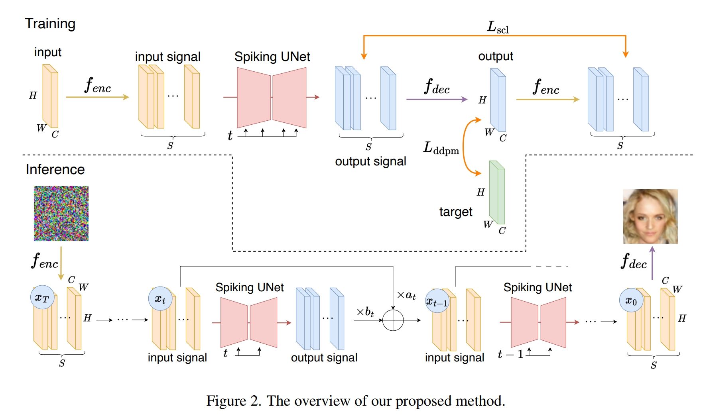
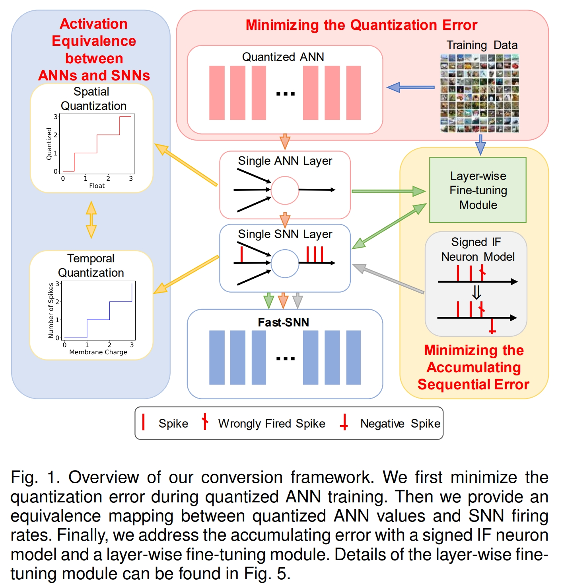

# Blog Embodied AI Related

---
## Contents
 - [Survey Paper](#survey-paper)
 - [Vision-Language Navigation](#vision-language-navigation)
 - [Embodied Agents](#embodied-agents)
 - [SNNs](#snns)

---

## Survey Paper

### [arXiv 2024] Aligning Cyber Space with Physical World: A Comprehensive Survey on Embodied AI [[PDF]](https://arxiv.org/pdf/2407.06886)
_Yang Liu, Weixing Chen, Yongjie Bai, Xiaodan Liang, Guanbin Li, Wen Gao, Liang Lin_

### [arXiv 2024] Vision-Language Navigation with Embodied Intelligence: A Survey [[PDF]](https://arxiv.org/abs/2402.14304)
_Peng Gao, Peng Wang, Feng Gao, Fei Wang, Ruyue Yuan_

### [arXiv 2024] A Survey on Vision-Language-Action Models for Embodied AI [[pdf]](https://arxiv.org/abs/2405.14093)
_Yueen Ma, Zixing Song, Yuzheng Zhuang, Jianye Hao, Irwin King_

### [github] Awesome-Embodied-Agent-with-LLMs [[github]](https://github.com/zchoi/Awesome-Embodied-Agent-with-LLMs)

---

## Vision-Language Navigation / Vision-Language-Action / Manipulation

### [NeurIPS 2023 Oral] LLaVA: Large Language and Vision Assistant [[PDF]](https://arxiv.org/abs/2304.08485)
_Haotian Liu, Chunyuan Li, Qingyang Wu, Yong Jae Lee_

### [ECCV 2024] SCENEVERSE: Scaling 3D Vision-Language Learning for Grounded Scene Understanding [[PDF]](https://arxiv.org/abs/2401.09340)
_Baoxiong Jia, Yixin Chen, Huangyue Yu, Yan Wang, Xuesong Niu, Tengyu Liu, Qing Li, Siyuan Huang_

### [ECCV 2024] Unifying 3D Vision-Language Understanding via Promptable Queries [[PDF]](https://arxiv.org/abs/2405.11442)
_Ziyu Zhu, Zhuofan Zhang, Xiaojian Ma, Xuesong Niu, Yixin Chen, Baoxiong Jia, Zhidong Deng, Siyuan Huang, Qing Li_

### [ICCV 2023] 3D-VISTA: Pre-trained Transformer for 3D Vision and Text Alignment [[PDF]](https://arxiv.org/abs/2308.04352)
_Ziyu Zhu, Xiaojian Ma, Yixin Chen, Zhidong Deng, Siyuan Huang, Qing Li_

### [RSS 2023] Structured World Models from Human Videos [[PDF]](https://arxiv.org/abs/2308.10901)
_Russell Mendonca, Shikhar Bahl, Deepak Pathak_

### [arXiv 2023] VoxPoser: Composable 3D Value Maps for Robotic Manipulation with Language Models [[PDF]](https://arxiv.org/abs/2307.05973)
_Wenlong Huang, Chen Wang, Ruohan Zhang, Yunzhu Li, Jiajun Wu, Li Fei-Fei_

### [ICML 2023] VIMA: General Robot Manipulation with Multimodal Prompts [[PDF]](https://arxiv.org/abs/2210.03094)
_Yunfan Jiang, Agrim Gupta, Zichen Zhang, Guanzhi Wang, Yongqiang Dou, Yanjun Chen, Li Fei-Fei, Anima Anandkumar, Yuke Zhu, Linxi Fan_

### [RSS 2023] Diffusion Policy: Visuomotor Policy Learning via Action Diffusion [[PDF]](https://arxiv.org/abs/2303.04137)
_Cheng Chi, Zhenjia Xu, Siyuan Feng, Eric Cousineau, Yilun Du, Benjamin Burchfiel, Russ Tedrake, Shuran Song_

### [arXiv 2023] EmbodiedGPT: Vision-Language Pre-Training via Embodied Chain of Thought [[PDF]](https://arxiv.org/abs/2305.15021)
_Yao Mu, Qinglong Zhang, Mengkang Hu, Wenhai Wang, Mingyu Ding, Jun Jin, Bin Wang, Jifeng Dai, Yu Qiao, Ping Luo_

### [NeurIPS 2023] A Dataset of Relighted 3D Interacting Hands [[PDF]](https://arxiv.org/abs/2310.17768)
_Gyeongsik Moon, Shunsuke Saito, Weipeng Xu, Rohan Joshi, Julia Buffalini, Harley Bellan, Nicholas Rosen, Jesse Richardson, Mallorie Mize, Philippe de Bree, Tomas Simon, Bo Peng, Shubham Garg, Kevyn McPhail, Takaaki Shiratori_

### [ICRA 2023] Ag2Manip: Learning Novel Manipulation Skills with Agent-Agnostic Visual and Action Representations [[PDF]](https://arxiv.org/abs/2404.17521)
_Puhao Li, Tengyu Liu, Yuyang Li, Muzhi Han, Haoran Geng, Shu Wang, Yixin Zhu, Song-Chun Zhu, Siyuan Huang_

### [CoRL 2022] R3M: A Universal Visual Representation for Robot Manipulation [[PDF]](https://arxiv.org/abs/2203.12601)
_Suraj Nair, Aravind Rajeswaran, Vikash Kumar, Chelsea Finn, Abhinav Gupta_

### [arXiv 2023] Mastering Diverse Domains through World Models [[PDF]](https://arxiv.org/abs/2301.04104)
_Danijar Hafner, Jurgis Pasukonis, Jimmy Ba, Timothy Lillicrap_

### [ICML 2023] BLIP-2: bootstrapping language-image pre-training with frozen image encoders and large language models [[PDF]](https://arxiv.org/pdf/2301.12597)

---

## Embodied Agents

### [CVPR 2024] PhyScene: Physically Interactable 3D Scene Synthesis for Embodied AI [[PDF]](https://arxiv.org/abs/2404.09465)
_Yandan Yang, Baoxiong Jia, Peiyuan Zhi, Siyuan Huang_

### [ICML 2024] An Embodied Generalist Agent in 3D World [[PDF]](https://arxiv.org/abs/2311.12871)
_Jiangyong Huang, Silong Yong, Xiaojian Ma, Xiongkun Linghu, Puhao Li, Yan Wang, Qing Li, Song-Chun Zhu, Baoxiong Jia, Siyuan Huang_

---

## SNNs

### Awesome Spiking Neural Networks [[github]](https://github.com/zhouchenlin2096/Awesome-Spiking-Neural-Networks)

### [IEEE Transactions on Artificial Intelligence 2024] Spiking Diffusion Models [[PDF]](https://www.arxiv.org/abs/2408.16467)
_Jiahang Cao, Hanzhong Guo, Ziqing Wang, Deming Zhou, Hao Cheng, Qiang Zhang, Renjing Xu_
-  

### [arXiv 2023] Spiking-Diffusion: Vector Quantized Discrete Diffusion Model with Spiking Neural Networks [[PDF]](https://arxiv.org/abs/2308.10187)
_Mingxuan Liu, Jie Gan, Rui Wen, Tao Li, Yongli Chen, Hong Chen_
-  

### [AAAI 2022] Fully Spiking Variational Autoencoder [[PDF]](https://arxiv.org/abs/2110.00375)
_Hiromichi Kamata, Yusuke Mukuta, Tatsuya Harada_
- 

### [arXiv 2023] Spiking Generative Adversarial Network with Attention Scoring Decoding [[PDF]](https://arxiv.org/abs/2305.10246)
_Linghao Feng, Dongcheng Zhao, Yi Zeng_

### [arXiv 2023] Fully Spiking Denoising Diffusion Implicit Models [[PDF]](https://arxiv.org/abs/2312.01742)
_Ryo Watanabe, Yusuke Mukuta, Tatsuya Harada_
- 
- 

### [IEEE TPAMI 2023] Fast-SNN: Fast Spiking Neural Network by Converting Quantized ANN [[PDF]](https://arxiv.org/abs/2305.19868)
_Yangfan Hu, Qian Zheng, Xudong Jiang, Gang Pan_
- 

### [ECCV 2022] Neural Architecture Search for Spiking Neural Networks [[PDF]](https://arxiv.org/abs/2201.10355)
_Youngeun Kim, Yuhang Li, Hyoungseob Park, Yeshwanth Venkatesha, Priyadarshini Panda_

### [NeurIPS 2024] SpikeLLM: Scaling up Spiking Neural Network to Large Language Models via Saliency-based Spiking [[PDF]](https://arxiv.org/pdf/2407.04752v1)
_Xingrun Xing, Boyan Gao, Zheng Zhang, David A. Clifton, Shitao Xiao, Li Du, Guoqi Li, Jiajun Zhang_

### [ICML 2024] SpikeLM: Towards General Spike-Driven Language Modeling via Elastic Bi-Spiking Mechanisms [[PDF]](https://arxiv.org/abs/2406.03287)
_Xingrun Xing, Zheng Zhang, Ziyi Ni, Shitao Xiao, Yiming Ju, Siqi Fan, Yequan Wang, Jiajun Zhang, Guoqi Li_

### [ECCV 2024] Integer-Valued Training and Spike-Driven Inference Spiking Neural Network for High-performance and Energy-efficient Object Detection [[PDF]](https://www.arxiv.org/abs/2407.20708)
_Xinhao Luo, Man Yao, Yuhong Chou, Bo Xu, Guoqi Li_

### [IEEE TSIP 2022] Federated Learning with Spiking Neural Networks [[PDF]](https://arxiv.org/abs/2106.06579)
_Yeshwanth Venkatesha, Youngeun Kim, Leandros Tassiulas, Priyadarshini Panda_

### [IEEE TPAMI 2021] Progressive Tandem Learning for Pattern Recognition with Deep Spiking Neural Networks [[PDF]](https://arxiv.org/abs/2007.01204)
_Jibin Wu, Chenglin Xu, Daquan Zhou, Haizhou Li, Kay Chen Tan_

---