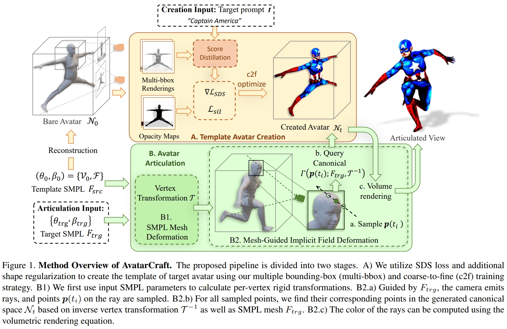
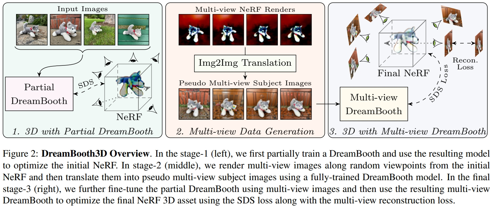

# Blog Generative Models Related

---
## Contents
 - [Fundation Models](#fundation-models)
 - [2D Generation](#2d-generation)
 - [3D Generation](#3d-generation)
 - [Other Interesting Works](#other-interesting-works)

---
## Fundation Models

### [!!!] [Meta AI] Segment Anything [[pdf]](https://arxiv.org/abs/2304.02643)
_Alexander Kirillov, Eric Mintun, Nikhila Ravi, Hanzi Mao, Chloe Rolland, Laura Gustafson, Tete Xiao, Spencer Whitehead, Alexander C. Berg, Wan-Yen Lo, Piotr Dollár, Ross Girshick_
- We take inspiration from NLP, where the next token prediction task is used for foundation model pre-training and to solve diverse downstream tasks via prompt engineering.
- Task generalization vs multi-task segmentation
- MAE pre-trained Vision Transformer (ViT)
- The data engine has three stages: (1) a model-assisted manual annotation stage, (2) a semi-automatic stage with a mix of automatically predicted masks and model-assisted annotation, and (3) a fully automatic stage in which our model generates masks without annotator input.
- Specifically, we prompt SAM to (1) perform edge detection, (2) segment everything, i.e. object proposal generation, (3) segment detected objects, i.e. instance segmentation, and (4), as a proof-of-concept, to segment objects from free-form text. These four tasks differ significantly from the promptable segmentation task that SAM was trained on and are implemented via prompt engineering.
- 
- 

### [!!!] [arXiv 2024] Stable Video Diffusion: Scaling Latent Video Diffusion Models to Large Datasets [[pdf]](https://arxiv.org/abs/2311.15127)
_Andreas Blattmann, Tim Dockhorn, Sumith Kulal, Daniel Mendelevitch, Maciej Kilian, Dominik Lorenz, Yam Levi, Zion English, Vikram Voleti, Adam Letts, Varun Jampani, Robin Rombach_
- In this paper, we identify and evaluate three different stages for successful training of video LDMs: text-to-image pretraining, video pretraining, and high-quality video finetuning. 
- We demonstrate the necessity of a well-curated pretraining dataset.
- Our model provides a strong multi-view 3D-prior.
- Our model provides a powerful motion representation for downstream tasks such as image-to-video generation and adaptability to camera motion-specific LoRA modules.

### [!!!] [OpenAI] CLIP: Learning transferable visual models from natural language supervision [[pdf]](https://arxiv.org/abs/2103.00020)
_Alec Radford, Jong Wook Kim, Chris Hallacy, Aditya Ramesh, Gabriel Goh, Sandhini Agarwal, Girish Sastry, Amanda Askell, Pamela Mishkin, Jack Clark, Gretchen Krueger, Ilya Sutskever_
- 
- To address this, we constructed a new dataset of 400 million (image, text) pairs collected form a variety of publicly available sources on the Internet. To attempt to cover as broad a set of visual concepts as possible, we search for (image, text) pairs as part of the construction process whose text includes one of a set of 500,000 queries. We approximately class balance the results by including up to 20,000 (image, text) pairs per query. The resulting dataset has a similar total word count as the WebText dataset used to train GPT-2. We refer to this dataset as WIT for WebImageText.

### [ICML 2021] ALIGN: Scaling up visual and vision-language representation learning with noisy text supervision [[pdf]](https://arxiv.org/abs/2102.05918)
_Chao Jia, Yinfei Yang, Ye Xia, Yi-Ting Chen, Zarana Parekh, Hieu Pham, Quoc V. Le, Yunhsuan Sung, Zhen Li, Tom Duerig_

### [OpenAI] DALL-E: Zero-Shot Text-to-Image Generation [[pdf]](https://arxiv.org/abs/2102.12092)
_Aditya Ramesh, Mikhail Pavlov, Gabriel Goh, Scott Gray, Chelsea Voss, Alec Radford, Mark Chen, Ilya Sutskever_
- We created a dataset of a similar scale to JFT-300M by collecting 250 million text-images pairs from the internet
- Stage One: Learning the Visual Codebook
- Stage Two: Learning the Prior

### [OpenAI] Grokking: Generalization beyond Overfitting on Small Algorithmic Datasets [[pdf]](https://arxiv.org/pdf/2201.02177.pdf)
_Alethea Power, Yuri Burda, Harri Edwards, Igor Babuschkin, and Vedant Misra_

### [!!!] [Google Research] VideoPoet: A Large Language Model for Zero-Shot Video Generation [[pdf]](https://arxiv.org/abs/2312.14125) [[project]](https://sites.research.google/videopoet/)
_Dan Kondratyuk, Lijun Yu, Xiuye Gu, José Lezama, Jonathan Huang, Rachel Hornung, Hartwig Adam, Hassan Akbari, Yair Alon, Vighnesh Birodkar, Yong Cheng, Ming-Chang Chiu, Josh Dillon, Irfan Essa, Agrim Gupta, Meera Hahn, Anja Hauth, David Hendon, Alonso Martinez, David Minnen, David Ross, Grant Schindler, Mikhail Sirotenko, Kihyuk Sohn, Krishna Somandepalli, Huisheng Wang, Jimmy Yan, Ming-Hsuan Yang, Xuan Yang, Bryan Seybold, Lu Jiang_
- A pre-trained MAGVIT V2 video tokenizer and a SoundStream audio tokenizer transform images, video, and audio clips with variable lengths into a sequence of discrete codes in a unified vocabulary. 
- An autoregressive language model learns across video, image, audio, and text modalities to autoregressively predict the next video or audio token in the sequence.
- A mixture of multimodal generative learning objectives are introduced into the LLM training framework, including text-to-video, text-to-image, image-to-video, video frame continuation, video inpainting and outpainting, video stylization, and video-to-audio. Furthermore, such tasks can be composed together for additional zero-shot capabilities (e.g., text-to-audio).
- Datasets. We train on a total of 1B image-text pairs and ∼270M videos (∼100M with paired text, of which ∼50M are used for high-quality finetuning, and ∼170M with paired audio) from the public internet and other sources, i.e. around 2 trillion tokens across all modalities. The data has been filtered to remove egregious content and sampled to improve contextual and demographic diversity.
- 
- 

### [NeurIPS 2023] DaTaSeg: Taming a Universal Multi-Dataset Multi-Task Segmentation Model [[pdf]](https://arxiv.org/abs/2306.01736)
_Xiuye Gu, Yin Cui, Jonathan Huang, Abdullah Rashwan, Xuan Yang, Xingyi Zhou, Golnaz Ghiasi, Weicheng Kuo, Huizhong Chen, Liang-Chieh Chen, David A Ross_
- 

### [NeurIPS 2023] Module-wise Adaptive Distillation for Multimodality Foundation Models [[pdf]](https://arxiv.org/abs/2310.04550)
_Chen Liang, Jiahui Yu, Ming-Hsuan Yang, Matthew Brown, Yin Cui, Tuo Zhao, Boqing Gong, Tianyi Zhou_

### [NeurIPS 2023] Alternating Gradient Descent and Mixture-of-Experts for Integrated Multimodal Perception [[pdf]](https://arxiv.org/abs/2305.06324)
_Hassan Akbari, Dan Kondratyuk, Yin Cui, Rachel Hornung, Huisheng Wang, Hartwig Adam_
- IMP integrates multimodal inputs including image, video, text, and audio into a single Transformer encoder with minimal modality-specific components. IMP makes use of a novel design that **combines Alternating Gradient Descent (AGD) and Mixture-of-Experts (MoE) for efficient model & task scaling**. We conduct extensive empirical studies and reveal the following key insights: 1) performing gradient descent updates by alternating on diverse modalities, loss functions, and tasks, with varying input resolutions, efficiently improves the model. 2) sparsification with MoE on a single modalityagnostic encoder substantially improves the performance, outperforming dense models that use modality-specific encoders or additional fusion layers and greatly mitigates the conflicts between modalities.
- 

---
## 2D Generation

### [CVPR 2023] DreamBooth: Fine Tuning Text-to-Image Diffusion Models for Subject-Driven Generation [[pdf]](https://arxiv.org/abs/2208.12242)[[Porject]](https://dreambooth.github.io/)
_Nataniel Ruiz, Yuanzhen Li, Varun Jampani, Yael Pritch, Michael Rubinstein, Kfir Aberman_
- Paper writing is hard to follow.
- In this work, we present a new approach for "personalization" of text-to-image diffusion models. Given as input just a few images of a subject, we fine-tune a pretrained text-to-image model such that it learns to bind a unique identifier with that specific subject. Once the subject is embedded in the output domain of the model, the unique identifier can be used to synthesize novel photorealistic images of the subject contextualized in different scenes. By leveraging the semantic prior embedded in the model with a new autogenous class-specific prior preservation loss, our technique enables synthesizing the subject in diverse scenes, poses, views and lighting conditions that do not appear in the reference images. We apply our technique to several previously-unassailable tasks, including subject recontextualization, text-guided view synthesis, and artistic rendering, all while preserving the subject's key features. We also provide a new dataset and evaluation protocol for this new task of subject-driven generation. 
- 
- 

### [Siggraph 2023] 3D Gaussian Splatting for Real-Time Radiance Field Rendering [[pdf]](https://repo-sam.inria.fr/fungraph/3d-gaussian-splatting/)
- We introduce three key elements that allow us to achieve state-of-the-art visual quality while maintaining competitive training times and importantly allow high-quality real-time (≥ 30 fps) novel-view synthesis at 1080p resolution. First, starting from sparse points produced during camera calibration, we represent the scene with 3D Gaussians that preserve desirable properties of continuous volumetric radiance fields for scene optimization while avoiding unnecessary computation in empty space; Second, we perform interleaved optimization/density control of the 3D Gaussians, notably optimizing anisotropic covariance to achieve an accurate representation of the scene; Third, we develop a fast visibility-aware rendering algorithm that supports anisotropic splatting and both accelerates training and allows realtime rendering. We demonstrate state-of-the-art visual quality and real-time rendering on several established datasets.
- 

### [arXiv 2024] FDGaussian: Fast Gaussian Splatting from Single Image via Geometric-aware Diffusion Model [[pdf]](https://arxiv.org/abs/2403.10242)
_Qijun Feng, Zhen Xing, Zuxuan Wu, Yu-Gang Jiang_
- 
- [Epipolar Line](https://en.wikipedia.org/wiki/Epipolar_geometry) and epipolar attention, [Epopolar geometry](https://web.stanford.edu/class/cs231a/course_notes/03-epipolar-geometry.pdf)

### [CVM 2024] Recent Advances in 3D Gaussian Splatting [[pdf]](https://arxiv.org/pdf/2403.11134.pdf)
_Tong Wu, Yu-Jie Yuan, Ling-Xiao Zhang, Jie Yang, Yan-Pei Cao, Ling-Qi Yan, Lin Gao_
- Gaussian Splatting for 3D Reconstruction
- Gaussian Splatting for 3D Editing
- Applications of Gaussian Splatting: Segmentation and Understanding, Geometry Reconstruction and SLAM, Digital Human [23, 125-156]

### [Google Research] StyleDrop: Text-to-Image Generation in Any Style [[pdf]](https://arxiv.org/abs/2306.00983) [[blog]](https://blog.research.google/2023/12/styledrop-text-to-image-generation-in.html)
_Kihyuk Sohn, Nataniel Ruiz, Kimin Lee, Daniel Castro Chin, Irina Blok, Huiwen Chang, Jarred Barber, Lu Jiang, Glenn Entis, Yuanzhen Li, Yuan Hao, Irfan Essa, Michael Rubinstein, Dilip Krishnan_
- 

### [NeurIPS 2023] SPAE: Semantic Pyramid AutoEncoder for Multimodal Generation with Frozen LLMs [[pdf]](https://arxiv.org/abs/2306.17842)
_Lijun Yu, Yong Cheng, Zhiruo Wang, Vivek Kumar, Wolfgang Macherey, Yanping Huang, David A. Ross, Irfan Essa, Yonatan Bisk, Ming-Hsuan Yang, Kevin Murphy, Alexander G. Hauptmann, Lu Jiang_
- SPAE tokens have a multi-scale representation arranged in a pyramid structure. The upper layers of the pyramid comprise semantic-central concepts, while the lower layers prioritize appearance representations that captures the fine details for image reconstruction. This design enables us to dynamically adjust the token length to accommodate various tasks, such as using fewer tokens for understanding tasks and more tokens for generation tasks.
- We term this approach as Streaming Average Quantization (SAQ) due to its resemblance to computing the average on streaming data.
- Progressive In-Context Decoding
- 

### [CVPR 2023] DynIBaR: Neural Dynamic Image-Based Rendering [[pdf]](https://arxiv.org/abs/2211.11082) [[project]](https://blog.research.google/2023/09/dynibar-space-time-view-synthesis-from.html)
_Zhengqi Li, Qianqian Wang, Forrester Cole, Richard Tucker, Noah Snavely_

---
## 3D Generation

### [arXiv 2024] V3D: Video Diffusion Models are Effective 3D Generators [[pdf]](https://heheyas.github.io/V3D/static/pdfs/V3D__arxiv_ver__.pdf) [[code]](t https://github.com/heheyas/V3D)
_Zilong Chen, Yikai Wang, Feng Wang, Zhengyi Wang, Huaping Liu_
- Motivated by recent advancements in video diffusion models, we introduce V3D, which leverages the world simulation capacity of pre-trained video diffusion models to facilitate 3D generation. To fully unleash the potential of video diffusion to perceive the 3D world, we further introduce geometrical consistency prior and extend the video diffusion model to a multi-view consistent 3D generator. Benefiting from this, the state-of-the-art video diffusion model could be fine-tuned to generate 360° orbit frames surrounding an object given a single image. With our tailored reconstruction pipelines, we can generate high-quality meshes or 3D Gaussians within 3 minutes. Furthermore, our method can be extended to scene-level novel view synthesis, achieving precise control over the camera path with sparse input views. Extensive experiments demonstrate the superior performance of the proposed approach, especially in terms of generation quality and multi-view consistency.
- 

### [arXiv 2024] 3D-SceneDreamer: Text-Driven 3D-Consistent Scene Generation [[pdf]](https://arxiv.org/abs/2403.09439)
_Frank Zhang, Yibo Zhang, Quan Zheng, Rui Ma, Wei Hua, Hujun Bao, Weiwei Xu, Changqing Zou_
- 

### [NeurIPS 2023] DreamHuman: Animatable 3D Avatars from Text [[pdf]](https://arxiv.org/abs/2306.09329)
_Nikos Kolotouros, Thiemo Alldieck, Andrei Zanfir, Eduard Gabriel Bazavan, Mihai Fieraru, Cristian Sminchisescu_
- The optimisation of the avatar structure is guided by the Score Distillation
Sampling loss powered by a text-to-image generation model.
- The optimisation of the avatar structure is guided by the Score Distillation Sampling loss powered by a text-to-image generation model. During training, we optimise over the NeRF, body shape, and spherical harmonics illumination parameters.
- 

### [Siggraph 2022] AvatarCLIP: Zero-Shot Text-Driven Generation and Animation of 3D Avatars [[pdf]](https://arxiv.org/pdf/2205.08535)
_Fangzhou Hong, Mingyuan Zhang, Liang Pan, Zhongang Cai, Lei Yang, Ziwei Liu_
- 

### [ICCV 2023] Synthesizing Diverse Human Motions in 3D Indoor Scenes [[pdf]](https://arxiv.org/pdf/2305.12411.pdf)
_Kaifeng Zhao, Yan Zhang, Shaofei Wang, Thabo Beeler, Siyu Tang_
- 

### [ICCV 2023] AvatarCraft: Transforming Text into Neural Human Avatars with Parameterized Shape and Pose Control
_Ruixiang Jiang, Can Wang, Jingbo Zhang, Menglei Chai, Mingming He, Dongdong Chen, Jing Liao_
- 

### [ICCV 2023] DreamBooth3D: Subject-Driven Text-to-3D Generation [[pdf]](https://arxiv.org/pdf/2303.13508.pdf)
_Amit Raj, Srinivas Kaza, Ben Poole, Michael Niemeyer, Nataniel Ruiz, Ben Mildenhall, Shiran Zada, Kfir Aberman, Michael Rubinstein, Jonathan Barron, Yuanzhen Li, Varun Jampani_
- Our approach combines recent advances in personalizing text-to-image models (DreamBooth) with text-to-3D generation (DreamFusion). We find that naively combining these methods fails to yield satisfactory subject-specific 3D assets due to personalized text-to-image models overfitting to the input viewpoints of the subject. We overcome this through a 3-stage optimization strategy where we jointly leverage the 3D consistency of neural radiance fields together with the personalization capability of text-to-image models. 
- 
- 

---
## Other Interesting Works

### [Google Research] AMIE: A research AI system for diagnostic medical reasoning and conversations [[pdf]](https://arxiv.org/abs/2401.05654) [[blog]](https://blog.research.google/2024/01/amie-research-ai-system-for-diagnostic_12.html)
_Tao Tu, Anil Palepu, Mike Schaekermann, Khaled Saab, Jan Freyberg, Ryutaro Tanno, Amy Wang, Brenna Li, Mohamed Amin, Nenad Tomasev, Shekoofeh Azizi, Karan Singhal, Yong Cheng, Le Hou, Albert Webson, Kavita Kulkarni, S Sara Mahdavi, Christopher Semturs, Juraj Gottweis, Joelle Barral, Katherine Chou, Greg S Corrado, Yossi Matias, Alan Karthikesalingam, Vivek Natarajan_
- 

### [NeurIPS 2023] Towards Generalist Biomedical AI [[pdf]](https://arxiv.org/pdf/2307.14334.pdf)
_Tao Tu, Shekoofeh Azizi, Danny Driess, Mike Schaekermann, Mohamed Amin, Pi-Chuan Chang, Andrew Carroll, Chuck Lau, Ryutaro Tanno, Ira Ktena, Basil Mustafa, Aakanksha Chowdhery, Yun Liu, Simon Kornblith, David Fleet, Philip Mansfield, Sushant Prakash, Renee Wong, Sunny Virmani, Christopher Semturs, S Sara Mahdavi, Bradley Green, Ewa Dominowska, Blaise Aguera y Arcas, Joelle Barral, Dale Webster, Greg S. Corrado, Yossi Matias, Karan Singhal, Pete Florence, Alan Karthikesalingam, Vivek Natarajan_
- 

### [Google Research] A new quantum algorithm for classical mechanics with an exponential speedup [[pdf]](https://blog.research.google/2023/12/a-new-quantum-algorithm-for-classical.html)
_Robin Kothari, Rolando Somma_

### [ICCV 2023] SparseFusion: Fusing Multi-Modal Sparse Representations for Multi-Sensor 3D Object Detection [[pdf]](https://arxiv.org/abs/2304.14340)
_Yichen Xie, Chenfeng Xu, Marie-Julie Rakotosaona, Patrick Rim, Federico Tombari, Kurt Keutzer, Masayoshi Tomizuka, Wei Zhan_

### [ICCV 2023] Audiovisual Masked Autoencoders [[pdf]](https://arxiv.org/abs/2212.05922)
_Mariana-Iuliana Georgescu, Eduardo Fonseca, Radu Tudor Ionescu, Mario Lucic, Cordelia Schmid, Anurag Arnab_

