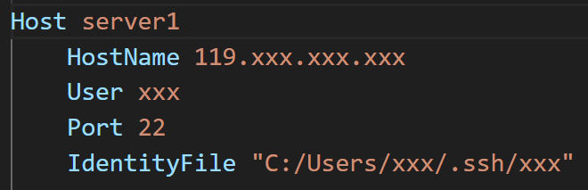

## 博士生成长之路 Path to A Senior PhD

---
### 目录

- [博士生成长之路 Path to A Senior PhD](#博士生成长之路-path-to-a-senior-phd)
  - [目录](#目录)
  - [欢迎大家补充和交流](#欢迎大家补充和交流)
  - [动机 Motivation](#动机-motivation)
    - [“要不要读博士”，是一个非常**重要**和**严肃**的问题。](#要不要读博士是一个非常重要和严肃的问题)
    - [1. 我的性格和能力适合读博士？](#1-我的性格和能力适合读博士)
    - [2. 我读博士是为了什么？](#2-我读博士是为了什么)
    - [3. 我能接受最坏的结果吗？](#3-我能接受最坏的结果吗)
    - [4. 如果你看到这里还没有被我劝退，那么恭喜你，你已经成功迈出了第一步！](#4-如果你看到这里还没有被我劝退那么恭喜你你已经成功迈出了第一步)
    - [\[回到目录\]](#回到目录)
  - [科研必备技能 Research Skills](#科研必备技能-research-skills)
    - [1. 代码相关](#1-代码相关)
    - [2. 文档](#2-文档)
    - [3. PPT](#3-ppt)
    - [4. 课程](#4-课程)
    - [5. 英语](#5-英语)
    - [\[回到目录\]](#回到目录-1)
  - [培养科研能力 Research Capability](#培养科研能力-research-capability)
    - [博士生应该具有的能力](#博士生应该具有的能力)
    - [\[回到目录\]](#回到目录-2)
  - [论文撰写 Paper Writing](#论文撰写-paper-writing)
    - [论文写作（简略版）](#论文写作简略版)
    - [论文写作（详细版）](#论文写作详细版)
    - [Title](#title)
    - [Abstract](#abstract)
    - [Introduction](#introduction)
    - [Method](#method)
    - [Experiment](#experiment)
    - [Related Work](#related-work)
    - [Conclusion](#conclusion)
    - [怎么改论文](#怎么改论文)
    - [\[回到目录\]](#回到目录-3)
  - [参考文档 Reference](#参考文档-reference)
    - [\[回到目录\]](#回到目录-4)

---
### 欢迎大家补充和交流

---
### 动机 Motivation

---

#### “要不要读博士”，是一个非常**重要**和**严肃**的问题。
<u>对于这个问题，不管你的答案是什么，也请你看完这个小节的内容。也许我的观点不算正确，但也希望或多或少地能帮助到你。</u>

读博是一个漫长的过程，对于直博的同学需要度过5-6年，对于硕士毕业接着读博的同学也是4-5年的日子。这段时间往往占据了一半的青春时光（20-30岁），这可是人生最美好的年华。所以，在思考这个问题和做出自己的决定前，请慎之又慎。在决定这个问题的答案时，请遵从自己内心的声音，思考以下问题：

#### 1. 我的性格和能力适合读博士？
- **选择适合自己性格的道路**：我们需要意识到这个世界上每个人都有不一样的性格，不同性格也适合干不一样的工作或事业。所以，不是所有人都适合科研的道路，而且科研也不会比其他行业更加高尚，选择适合自己性格的工作或事业才是让人生过得开心、快乐和充实的根本。
  - 举一个真实的例子吧，他是我这么多年以来第一次碰见的和我一个姓的同学，他非常喜欢游戏，对很多不同类型的游戏都非常了解，他从电子科大毕业后，那一年入学我们组的硕士，导师安排他做一个医学图像的项目，几个月之后，他找到我说他非常的痛苦和焦虑，因为自己觉得很煎熬而且进展也不顺利，我便开导他说不是所有人都适合搞科研，更不是科研要比其他行业更加高尚，忽略周围的噪声，认真思考适合你性格的道路。最后，他转成授课型硕士，1年半硕士毕业后去了网易游戏策划，他家也在广州，后来和他聊天也可以真切感受到他那种发自心底的笑容，也非常为他开心。
  - 总结下，大概就是“性格+选择=人生”，意思是说你的性格和你的选择将直接决定你的人生是否快乐，我想应该没有人想让自己的人生一直在痛苦和折磨中度过吧。

- **不骄不躁的心境和严谨认真的态度**：我认为这是读博所需要的两个最重要的性格。长达5年的时间里，你将经历：自己的论文屡次被拒，自己的想法被别人指指点点，自己的想法已经被同行做出来了，同学屡次中了好论文和奖学金，同学拿到了你梦寐以求的大厂实习，同学找到了150W年薪的工作……
  - 不骄不躁的心境，指的是一种能以**平常心**对待生活中起起伏伏的心境。我非常喜欢岳阳楼记里“不以物喜，不以己悲”这句词，表达的是不因事物好坏而悲喜的人生态度。做研究和读博士是一个周期非常长的事情，当你能做到不骄不躁的时候，也就意味着你能够时刻保持自己的步伐。也许你并没有意识到自己在默默地前进，但是等你有一天真正达到那一个（阶段性）的目标时，你会怎么样？开心是一定的，但是你应该会淡然地继续前进！反之亦然。
  - 严谨认真的态度，指的是能够对待工作和生活中的**大小事**都认真严谨。这不仅仅体现在学习或者工作上，也体现在生活上。我想大家应该都不愿意和不靠谱的人合作或者交朋友吧。举一个真实的例子吧，他是当年我们组的硕士，他在第三年冬季拿到了另外一个大学的博士录取，大学和地理位置都很好，之后3月份的时候，他在硕士毕业论文还没有写的情况下，和导师商量想要一个月以后安排毕业答辩，这样能赶上春季的毕业典礼。结果可想而知，他被导师拒绝了，并发生了不必要的争执。总结下，如果一个人没有严谨认真的学习或者工作态度，会给自己的合作者或朋友不再赏识你，从而错失了很多很好的机会。
  - 总结下，不骄不躁的心境是希望你能尽量远离生活中的焦虑，从容快乐地度过自己的人生；严谨认真的态度是希望你做一个靠谱的人，在人生道路上结交更多益友，为自己争取到更多更好的机会。


#### 2. 我读博士是为了什么？

- **正确的目的**
  - 我发自内心地想挑战一下，而不是出于虚荣心（下面会提到）。我决定读博之后能有坚持下去的勇气，既然选择了就坚持把这件事做完做好。
  - 我喜欢（至少不反感）这个行业，想要在这个行业有更深入的发展。
- **错误的目的**
  - 出于虚荣心，例如：“所谓的” 更好的工作、更高的薪水、更光明的未来，家人和朋友都觉得读博很牛，身边的朋友都读博了等等。统计学上有一个概念叫**幸存者偏差**，简而言之就是只看到了生存者的成功，而无法看到那些失败者的故事。众多博士毕业生们最后成为行业大牛的微乎其微，大多数人还是做着普通平凡（不是碌碌无为）的工作。如果你要问“为什么不可以是我成为行业大牛？”这样的问题，那么你可能还没有做好读博士的准备和成为大牛必备的素质，读博期间你会很焦虑甚至崩溃也是大概率会发生的。
  - 出于试试的心态。人生确实应该多尝试不同的选择，但是我想说这是建立在你对自己的性格有清晰的认识之上的。读博的过程是需要坚持的，特别是在有大量的代码和实验需要完成的时候，写论文有很多麻烦事情的时候，发现自己的收入和硕士毕业工作的同学比少的可怜的时候。如果只是以试试的心态，那么结局注定是无疾而终，与其浪费时间，不如尝试点更适合自己的事情。举一个真实的例子吧，他是当年另一个老师组的硕士生，一直在犹豫要不要读博士，于是先硕士毕业了，但是正值yq放开，就业市场异常萧条，于是选择继续读博了。1年之后，他告诉我读博士又累又穷，准备退学去找工作了。

#### 3. 我能接受最坏的结果吗？

- **能不能毕业和要不要毕业是两个完全不一样的问题**：很多同学会理想化地觉得我应该早点毕业，不需要4-5年，这样能早点拿到学位然后摆脱穷苦的日子。但是，他们太过于理想化现实了，忽略了一个非常关键问题，能不能毕业和要不要毕业是两个完全不一样的问题。
  - 能不能毕业，指的是说有没有达到学校或者导师的博士毕业要求。这一点在问题1中提到了，在决定读不读博之前要对自己性格有深入的分析，其中也包括自己的学习能力。如果你能考上国内的重点大学，那么证明你的能力一般来说是足够满足毕业要求的。从我的经历来看，如果你有严谨认真的工作态度，那么即使你的能力稍微差点，也能达到毕业要求。
  - 要不要毕业，指的是我毕业之后在就业市场有没有足够的竞争力。很多刚开始读博的同学会想当然的以为尽早毕业，能早点找工作。但是，他们忽视了和你们竞争工作岗位的大概率是读了5年以上，甚至还有博后的一群人。他们的成果往往比你更多，所以早毕业往往意味着成果不如那一群人，找工作的过程中只能占据下峰。所以，选择合适的时间毕业，才是正确的选择，这也是为什么大部分人都需要读至少4-5年的博士。
- 总结下，要想好自己能不能接受花费的这5年青春所得到的最差结果（例如多次延期毕业，毕业时成果不多，找到的工作一般，持续单身等）。


#### 4. 如果你看到这里还没有被我劝退，那么恭喜你，你已经成功迈出了第一步！

#### [[回到目录]](#目录)

---
### 科研必备技能 Research Skills

#### 1. 代码相关

- **VSCode相关**
  - [VSCode](https://zhuanlan.zhihu.com/p/675265926)几乎集成了所有写代码所需要的功能。下面列举几个常用的功能：
    - **ssh远程连接**（插件：Remote-SSH, Remote - SSH: Editing Configuration Files, Remote Explorer）。在Remote Explorer的config文件中，可以配置对应的格式。
      - 
    - **代码自动格式化**（插件：Black Formatter）。**代码整齐是非常有必要的好习惯**，能够降低bug的出现概率，也方便自己理解和查找所写的代码，提高效率。shift+ctrl+p之后，输入“format with ...”，就能设置每次保存文件后自动格式化代码。
    - **markdown**（插件：Markdown All in One）。非常推荐用markdown写文档，原因在于可以方便地插入公式、图片和表格，同时可以通过插件很方便地转化为html、pdf等格式。
    - **github**（自带GitHub，插件：GitHub Copilot）。VSCode本身自带GitHub，需要本地配置git环境（windows和mac的配置方式不一样）。GitHub Copilot能自动根据上下文联想代码，能够节省很多时间，特别是写重复代码的时候（需要付费，10 USD/月）。同时，需要学习git常用的命令，例如git clone, git clone, git config, git commit, git push等，但是VSCode有图形界面能够把代码push到仓库中，比较方便。
    - **个人和项目网页部署**。首先需要创建自己的个人网页，例如[我自己的页面](https://github.com/JimmyZou/JimmyZou.github.io)，主要包含css style文件和index.html文件，然后可以在```Settings->Pages```中进行部署，注意github账号名```xxx```可能需要对应```xxx.github.io```。可以在代码仓库中单独创建```docs/```来创建，例如[这个页面](https://github.com/JimmyZou/project_page_example)对应的[仓库地址](https://jimmyzou.github.io/project_page_example/)。
    - **其他插件**。同样可以安装对应插件以打开html，pdf，MP4等文件，这样如果结果在服务器上就不用下载到本地再打开查看。另外，还有markdown自动转为html文件的插件，可以将markdown写的文档自动转为html，这样就可以在个人网页上显示你的文档了。

- **Linux系统相关**
  - [命令行大全](https://zhuanlan.zhihu.com/p/420247468)，以下列举常用的命令：
    - cd, ls, mkdir, rm, top, htop, mv, cp, nohup, df, pwd
    - scp, rsync, tar, zip, wget, vim
    - ps, kill, pkill
    - tmux, watch, nvidia-smi
    - **需要熟练掌握以上每一个命令行的用处**。由于有些命令比较复杂，建议在自己的文档里把常用的命令模板加上，例如“rsync -avP -e "ssh -i C:/Users/xxx/.ssh/xxx" ./amass* xxx@119.xxx.xxx.xxx:/data”。这样能够提高工作效率。
  - python的安装与使用（conda的虚拟环境管理）
    - 选择安装[miniconda](https://blog.csdn.net/m0_73625420/article/details/128313467)，较为节省空间。然后使用conda创建若干个虚拟环境。
    - conda与pip安装模块的区别：conda能够自动匹配合适的模块版本，pip只默认安装最新的模块版本。所以尽量使用conda install来安装模块，如果没有比如opencv-python，可以再用pip install。
    - conda安装torch时，可以选择对应的cuda版本，因为conda在安装torch时会同时安装cuda，所以安装时选择好对应的cuda版本。其次，pytorch3d的安装也可以通过conda，从而避免版本冲突导致的无法使用的问题。而pip是没法做到这一点的。
  - docker 实验室暂时还未启用，之前在企业用过，感觉非常好用，完全不用担心环境配置的问题
  - 补充内容可以参考 [设备配置](https://pengsida.notion.site/59569d7b66954578b21bf1dc6ea35776)。
- **Latex相关**
  - **Overleaf在线编辑**。写论文通常会使用latex，通常会议、期刊或毕业论文已经提供了对应的模板，写论文需要做的就是往模板里添加自己的内容。
  - **公式编写**。可以参考这个[指导教程](https://zhuanlan.zhihu.com/p/570153914)，并在overleaf上自己创建一个项目尝试编辑公式。主要用到的有：各种符号，特殊字符、上标，下标，分式，多行公式并列等。
  - **文献管理**。参考[BibTeX攻略](https://zhuanlan.zhihu.com/p/682054783)。通常，google scholar里，某一篇文献下面有```cite```，其中有```BibTex```，然后粘贴到```.bib```文件中即可。
    - 
  - **图和表格**。论文里的图一定要用**矢量图**（即无限放大不会变模糊的图），通常会在幻灯片里整合，然后将某一页单独保存为pdf，然后进行适当地裁剪，然后放到论文里。表格可以参考[这篇论文](https://www.overleaf.com/read/tgbfrnwrwczz#6dc036)里的模板，需要自学怎么合并左右或上下单元格等命令。

#### 2. 文档

**<u>写文档是一个非常有必要的习惯，是对平时工作的一个记录和积累，在需要用到的时候可以给你提供便利，磨刀不误砍柴功，例如将来某个时候需要参考、做汇报时需要素材、需要经常解决常见问题等等。</u>**

- **课程学习文档**
  - 样例来自于我们组的同学：[随机过程](https://github.com/JimmyZou/project_page_example/blob/main/notes/stochastic%20process.md)、[机器学习](https://github.com/JimmyZou/project_page_example/blob/main/notes/machine_learning.md)。
  - 如果Latex公式没法在网页上显示，请安装chrome的MathJax插件或者在vscode中打开。
  - 如果文档太长，可以在markdown中设置目录跳转，如下图所示：
    - 
    - 
  - 但是发现转成html之后，目录跳转功能没法顺利转换，需要手动在html中设置。（**解决有奖！**）
- **论文阅读文档**
  - 样例来自于我自己：[论文阅读记录](https://jimmyzou.github.io/src/blog_human_shape_recon.html)。
  - 用markdown中记录论文的重要内容，[上述对应的md文件](https://github.com/JimmyZou/JimmyZou.github.io/blob/main/src/blog_human_shape_recon.md)，包括出处、标题、作者、PDF链接、代码链接、摘要、pipeline图。大部分内容在arXiv的论文页（非pdf页）就有。
  - 另外一种方式，在看论文的时候，把部分画图或展现方式非常有借鉴意义的部分截取下来，总结在一个PPT里。之后自己写论文的时候，能够借鉴别人的优点来展现自己的工作。Credit to [Wei Ji](https://scholar.google.com/citations?user=G4uCKHcAAAAJ&hl=en)
- **实验日志文档**
  - 样例来自于我们组的同学：[实验文档1](https://github.com/JimmyZou/project_page_example/blob/main/notes/audio2text.md)、[实验文档2](https://github.com/JimmyZou/project_page_example/blob/main/notes/motion_diffusion_model.md)。
  - 主要用于记录实验中遇到的问题，这样下次自己或者同学遇到相同问题的时候，能迅速提供参考。

#### 3. PPT

- **画论文中的插图**
  - PPT里非常好用的三个技巧：1. 组合不同图形，实现大图中不同小模块的构建； 2. 手动输入模块的宽度和高度，能够迅速保证不同模块的大小一致； 3. 自动对齐，选中不同的（组合）模块，左右上下居中对齐都可以（不要再用鼠标对齐了！）。
  - 部分比较好看的模块，主要通过“小模块叠加+3D视图+旋转”构造，需要花时间在图形设置中尝试不同参数看效果。
  - PPT中的额外插件：iSlide，Latex，OneKey，ThreeD等。（暂未尝试，用过的同学，**反馈有奖！**）
- **实验室日常科研工作汇报**
  - **汇报PPT的大忌**（重要性按顺序递减）：前后幻灯片格式不统一（图片或文字区域来回跳跃或没对齐）、大段文字内容（无法抓住重点）或文字太小（无法突出重点）、包含复杂的图（无法明白哪个地方是重点）、废话多（3个词可以概括的内容写一整句话）
  - **做PPT的目的**：希望**用PPT更加直观、简洁展现自己想要表达的内容**，而不是把PPT作为一个笔记本给观众看。
  - **做PPT的要点**：与上述大忌对应
    - **前后幻灯片格式一致**：标题部分、文字内容、插图在每一页幻灯片中的位置尽量固定，字号和字体一致，空间允许的情况下尽量用**更大号**的字体。
    - **文字内容要简洁**：文字内容尽量不要用一整句话，把**关键词**总结出来，与本页幻灯片的目的不相关的内容去掉。不同层次的内容要用能轻易分别不同大小的字号或字体，要尽量突出内容层次。更加详细的内容可以放在最后的附录，需要的时候才展示。
    - **插图的展示**：插图通常有两类作用，展示方法流程和展示视觉结果。对于方法流程，可以分别给每一部分加上注释，强调图中该**区域的重点**。有些部分不需要过多解释的话就跳过这一部分，将重点部分标出，并用简短文字强调特点。对于视觉结果，需要把需要突出对比的部分放大或标出，然后用简短的文字解释哪里不好。插图较为灵活，所以简短文字的位置可以比较自由。
      - 
    - **插入视频的展示**：一定要用PPT里内置的插入视频导入，```ctrl c```和```ctrl v```并不会真正导入PPT，换一台电脑就找不到视频，无法播放。
- **学术报告幻灯片**
  - 参考 [如何做学术报告幻灯片](https://pengsida.notion.site/slides-810f02670691444f8c94cc3d5b76dcbc)。

#### 4. 课程

参考 [入门3D Vision的科研](https://github.com/pengsida/learning_research/blob/master/getting_started_in_research.md)

- 机器学习
  - 西瓜书 周志华老师著
  - 多伦多大学 [机器学习课程1](https://www.cs.toronto.edu/~rahulgk/courses/csc311_f22/index.html)，[机器学习课程2](https://erdogdu.github.io/csc412/)
- 计算机视觉
  - 斯坦福大学 [计算机视觉与三维重建](https://web.stanford.edu/class/cs231a/) [深度学习与计算机视觉](http://cs231n.stanford.edu/)
  - 图宾根大学 [三维计算机视觉](https://uni-tuebingen.de/fakultaeten/mathematisch-naturwissenschaftliche-fakultaet/fachbereiche/informatik/lehrstuehle/autonomous-vision/lectures/computer-vision/)
- 计算机图形学
  - 如果对传统图形学的知识感兴趣，还需要看[GAMES101-现代计算机图形学入门](https://games-cn.org/intro-graphics/)、[GAMES202-高质量实时渲染](https://sites.cs.ucsb.edu/~lingqi/teaching/games202.html)（闫令琪老师开的课，讲得特别好）。
  - 如果对motion synthesis/computer animation感兴趣，还需要看[GAMES105-计算机角色动画基础](https://games-105.github.io/)（刘利斌老师开的课，讲得特别好）。

#### 5. 英语

- **主要依靠平时积累**：科研中用到的词汇比较有限（专有名词或概念除外），句型和表达也比较有限。所以如果英语不算好的同学，建议在看论文的过程中，积累不认识的单词到文档中或借助在线翻译软件（有道之类的）。可能刚开始阅读英文论文速度较慢，但是需要坚持锻炼和记忆。即使像我这样没有语言天赋的人也能做到，虽然当年学英语的过程实在是太痛苦了。


#### [[回到目录]](#目录)

---
### 培养科研能力 Research Capability

博士生应该具有的能力、如何锻炼这些能力、如何做科研项目：[[参考1]](https://github.com/pengsida/learning_research/blob/master/getting_advanced_in_research.md)，[[参考2]](https://pengsida.notion.site/research-project-b43507ef26d044bd888ac29f4736e116)。


#### 博士生应该具有的能力
- **阅读**：阅读大量论文、进行文献综述、构建文献树、追踪积累最新论文/技术 [[参考]](https://pengsida.notion.site/literature-tree-literature-review-novelty-tree-challenge-insight-tree-f8b36e484b344a2893a94e4608b72ec2)
  - 建立对这个领域的视野，知道大家在解决什么问题，培养对重要问题的认知，知道什么是好的论文。
  - 积累解决问题的动机和技术。
  - 用[[文献树]](https://pengsida.notion.site/d192db870bc64436ae4a4a590b36772a)（novelty tree和challenge-insight tree）锻炼和积累想创新点的能力。
- **创新**：想创新点的能力、检索发现新事物的能力、目标驱动的科研能力、提出新技术的能力 [[参考]](https://pengsida.notion.site/idea-da6ce171c13846b7a7ffaa7473ffa6ea)
  - **做研究要先懂得检索**。不管自己想到什么事，都先检索看看有没有相关的解法或内容以作为参考，这样能给自己省很多功夫，并且拓宽很多思路。
  - **目标驱动的科研**（goal-driven research）让自己的研究更有规划、有连续性，让自己的研究更容易出类拔萃。
  - 实时关注相关领域的进展，**其他领域的方法或者思路能够带来关注领域内新的灵感**。从而提出新的技术来解决本领域的问题。
  - 具体来说：
    1. 规划科研方向的愿景（general goal），制定达到这个愿景的路线图（roadmap）。一般而言，愿景容易定义，但制定路线图需要对领域有深刻的理解，一般由导师或者高年级博士来思考和制定。
    2. 根据novelty-tree列出的路线图，选择有研究空间的任务，调研这个任务有没有重要的技术难题。**选题是对一个科研项目影响最大的一步**，而不是后面的想方法。
       - 去思考这个任务长远的目标，一个最终形态是怎样的。为什么当前工作只在这些数据上做，而不在其他数据上做。
       - 应该尝试更多通用场景（general cases）。追求发现新的失败例子（failure cases），**从新的失败例子入手改进原有的技术**。
       - （1）在新的任务设定或者新的数据上容易发现新的失败例子。（2）在新的数据上探索方法的可能性，让大家看到新的实验结论，这是很大的贡献。
    3. 从技术层面上分析现在的技术路线（pipelines）在某个任务上不工作的原因，在技术模块（pipeline module）层面思考可能的原因，然后在技术路线上或高层次（high-level）理解上思考可能的原因。
    4. 上升到高层次理解和想法、技术路线、技术模块层面进行创新，想出一些技术贡献。怎么提升改进技术路线的能力？
       - 首先要知道有哪些技术，这些技术在解决什么问题。然后组合其中的某些技术。
       - （1）构建challenge-insight tree。（2）选择challenge-insight tree中的某些技术，通过创新性的组合来解决当前任务的技术难题。（3）**把可能的pipeline都列出来，然后对比优劣势，选择一个pipeline。**
       - 一个高水平科研工作者认为：技术的本质就是对方法做组合，把小的技术组合成大的技术，把老的技术组合成新的技术。**组合已有的技术并挖掘其在新的任务、新的数据上的性质，是一个很大的贡献。**组合不能是```input->A-> intermediate output->B->output```这种完全A + B的组合（完全拼接式的组合）。组合需要是具有创新性的组合。正常情况下直接拼接两个方法也无法解决问题，否则这个问题就没啥技术挑战。
    5. 在一些数据上验证这个技术贡献，调效果。不能期望论文故事线好听、应用有意思，审稿人就会放过我们的技术贡献。
    6. 当出现新锤子的时候，非常值得拿新锤子来做自己路线图上的某一个里程碑任务（milestone task），这样容易做出有影响力的工作。注意，不是在新锤子原有任务设定上做改进（比如在NeRF的task setting上调它所用数据集的view synthesis的效果），而是**拿新锤子来解决自己在做的里程碑任务的问题**（仍然是目标驱动的研究方式）。
    7. 想idea时需要注意的点（什么样的project不值得做）
       - 提出idea并做一篇论文是为了给领域做出实际的贡献，不是为了论文本身。
       - 如果一篇论文对领域没有贡献，那么做这篇论文就是在浪费自己的时间，因为我们不会通过这篇论文收获领域的respect，甚至可能收获负面评价。
       - 做这种论文的好处：（1）熟悉投稿流程。（2）有几率收获一篇论文（但概率较小）。
       - 做这种论文的坏处：（1）浪费时间。做这个project的时间可以用来做更有意义的事情。（2）可能被人负面评价。
    8. 特别需要注意的点：不要形成依赖导师的心理，要锻炼自己独立自主做科研的习惯和能力。（某种角度上可以说比发论文本身还重要。而且其实自己要有这个能力才能大概率做出论文，不然这个项目基本无疾而终）
- **实践**：代码能力、实验能力、分析实验不工作的原因的能力
  - 实现自己的想法。
  - 在实验中改进自己的想法。
  - 在实验中积累对技术方法的认知，通过实验发现一些技术能解决的问题和不能解决的问题。
  - 在实验中发现一个科研方向存在什么不足之处、存在什么难以解决的问题。
  - 具体来说：
    1. 如何设计探索性实验，保持清楚的实验思路，提升改进Idea的效率。
       - 现在的实验是否同时包含了几个**探索方向（exploration points）**？怎么修改实验来减少要同时探索的点？
       - 现在的实验是否同时包含了几个**技术挑战（technical challenges）**？怎么修改实验来减少其中的技术挑战？
       - 我们目前重点想先搞清楚的探索点是什么，最想解决的技术挑战是哪个？
    2. 把复杂的事情拆解成一组简单的事情，从简单到复杂。
       - **拆解复杂的实验**：从简单的设定开始探索，慢慢加大难度，然后做实际的设定。能够有效降低实验和时间成本。
       - **拆解创新的想法**：把自己的想法分解成各个部分，从可控的想法开始做起，再加探索性、创新性的框架/模块。
    3. 在简单任务上做实验（toy experiment）
       - **简化实验设定**，保留想解决的技术挑战。
       - **简化数据**，保留想解决的技术挑战。
       - 验证自己写的模型训练代码是否工作，先过拟合一个样本，然后再过拟合一个非常小的数据集上（比如20个训练样本）。
    4. 实验结果分析
       - [结果] 失败案例（Failure case）的可视化长什么样？可能是什么导致的？相应的可能原因也可视化看看。3D可视化工具：
         - [https://github.com/zju3dv/Wis3D](https://github.com/zju3dv/Wis3D)
         - [https://github.com/koide3/iridescence](https://github.com/koide3/iridescence)
         - [https://github.com/nerfstudio-project/viser](https://github.com/nerfstudio-project/viser)
       - [结果] 失败案例有没有什么规律，有没有什么固定的pattern？这些规律可能引出背后的技术原因。
       - [代码] 各个模块代码的中间输出是否符合预期？
       - [训练] 现在方法在测试集上效果不好，那训练集能效果怎样？能过拟合吗？
       - [训练] 在其他简单的数据上效果怎样？
       - [训练] 记得我们在数据A上效果还不错，为啥数据B上不行？两个数据的区别是啥？
       - [方法] 我记得算法A在这个数据上效果没这么差。为啥我们的方法这么差？需要ablation看看哪个模块有问题？也可能是代码写bug了。
       - [方法] 如果是把方法简化，能工作吗？效果怎样？
       - [方法] 有可视化过某个模块的输出吗？看看是否符合预期，或者是否存在什么奇怪的现象？
    5. 实验结果不理想
       - 请注意，快速迭代建立在有效实验的基础上。盲目的做实验可能让事情变得更糟。
       - 要经常性地确认自己在正确的方向上：当前的算法思路真的对吗。要避免陷入local minima。建议经常找同学交流讨论。
       - 
- **展示**：写作能力、展示能力、把一篇论文做得漂亮的能力、做演示（demo）的能力
  - 做一篇有影响力、阅读量高的论文，发表在高水平会议、期刊上。
  - 把自己的研究故事、提出的技术清晰地展示给同行。
  - 用演示来吸引读者，提高论文的阅读量和关注度，从而提升论文的影响力。
  - 具体内容见“论文撰写 Paper Writing”。
- **交流**：和导师、同学交流讨论的能力
  - 让大家帮助自己做科研。
  - 交流讨论对于科研的重要性（解决自己的疑问、验证自己的想法、启发思路、促进同学之间的关系）。
  - 具体来说
    1. **讨论的目的：让大家帮助自己project的推进。不要把“讨论”当作工作汇报。**
    2. 讨论的时候，一些同学害怕“讨论”时间过短，而显得自己没做事情，而可能被导师责怪。所以，通过分享论文、分享繁琐细节的实验现象来凑时长（可能因为遇到一些问题而导致没什么进展才想着凑时长，也可能出于其他考虑才这么做）。
    3. 如果真的没啥问题，请直接skip讨论，简单同步一下进展和接下来的规划。如果遇到了问题，就列出要讨论的问题，把“讨论”的重心放在“自己遇到的问题”上。讨论结束地很快也没事，效率越高越好。
    4. “讨论”不要分享论文、不要分享繁琐细节的实验现象。什么内容可以体现自己的思考：“智慧有深度的提问”、“对project的规划”、“对技术创新性的思考”。
    5. 需要预先做一个简单的ppt。ppt内容可以这么组织：（1）列出需要讨论的问题，和大家一起讨论解决。先抛出问题，然后带着问题去看细节，讲一些自己的思考。看细节的时候，列一些重要的实验现象在ppt里.（2）列出有意思的实验现象和结论。（3）对于科研项目的讨论，**有必要每次讨论的时候review一遍technical contribution**（因为已经受够了review里被reviewer喷contribution不够，或者project做了几个月以后发现没contribution而导致几个月白费）。（4）列出自己下一周的计划。
    6. 实验室讨论原则：（1）充分的沟通交流。交流的时候不要害怕老师、高年级同学，不要因此而不敢问问题。有问题请及时问。实验室的老师、学长都非常友好，乐于解答问题。讨论交流的唯一目的是: 正确、高效，能解决你对project的疑问。（2）平等的交流，不是汇报与被汇报的关系。如果科研上有自己的想法，请表达出来。如果觉得老师、学长有说错的地方，请有礼有节地质疑和讨论。不要一味地听信老师、学长的话，但更不要表面服从而底下做自己的想法，这样会浪费很多交流时间和实验成本。实验室的讨论追求高效真诚的沟通。


#### [[回到目录]](#目录)

---
### 论文撰写 Paper Writing

论文写作模板：[参考](https://pengsida.notion.site/c1a22465a0fa4b15a12985223916048e)[1]。

#### 论文写作（简略版）
- 写论文的步骤：
  1. 梳理论文的story（倒推，然后正推。详细做法见Introduction部分）。整理成story以后，写一个introduction的初稿。同时列出要做的comparison experiments和ablation studies，并开始做起来。先做ablation studies，确定最优的方法版本，再做对比实验。Baseline methods的实验可以同步跑起来。
  2. 画一个清楚的pipeline figure的草图（流程步骤定清楚）。
  3. 写method，同时做实验。
  4. 改introduction和method，同时做实验。
  5. 实验做差不多以后，写experiment。
  6. 写related work。
  7. Review论文。改论文的introduction、method和experiment。
  8. 写abstract，取论文名字。
  9. 反复review论文，改论文。
- 论文收获好review的关键
  1. **把论文做得漂亮、美观，让人第一印象觉得这篇论文很高级。**
  2. 好看的teaser figure、pipeline figure。
  3. 好看的表格和结果图。
  4. 整齐的排版。
- 段落写作原则：
  1. 一段文字一定好表达好一件事情。
  2. 一段文字开头第一句就要让读者知道这段在说什么。
  3. 基本思路：先列写作思路，然后细化每一部分的思路，再写具体的英语句子。注意段落、句子之间的逻辑关系（flow），flow的概念具体看这个文档。
  4. **写论文一定要“如切如磋，如琢如磨”，反复品味，揣摩读者是否读得懂。“自我评阅论文写作是否清楚”的能力非常重要。知道有问题才能知道要改。**
- 如何判断论文段落的写作是否清楚
  1. 从读者的角度读论文段落。有几点可以检查的：
     - 这一个段落是否有一个明确的主题？
     - 段落的第一句话是否讲清楚了这一段要说什么。
     - 句子中的每一个名词（概念），读者是否能读懂。是否能实现自洽（self-contained）。
     - 两个句子之间的逻辑，是否连续。
  2. 根据已经写出的段落列出该段落的写作思路，看看思路是否通顺。
- 论文写作的关键时间点（从截稿时间一个月前开始计划）
  1. 截稿时间四周前：很可能没有把论文method完全定下来，也没有把实验全部做完。但基本会把论文的story定下来了，因此可以开始写论文、开始规划要做哪些事情。
     - 整理现有的story，包括core contribution、方法的各个模块及其motivation。
     - 列出要做的comparison experiments和ablation studies。
     - 这一周写一个introduction的初稿。
  2. 截稿时间三周前：这一周最好能把方法定下来。
     - 把pipeline figure的流程图草图画清楚，定下来。
     - 确认好pipeline figure以后，写一个method的初稿。这一周至少method框架定下来了，所以可以把method开始写起来。如果方法的细节还没定下来，就在相应的地方写给\todo{}，先空着，至少把method的框架写出来。
     - **这周截止，必须把introduction和method的初稿给导师改，不然导师很可能改不完论文**。
  3. 截稿时间两周前
     - 这一周把experiments, abstract, related work写一个初稿。
  4. 截稿最后一周
     - 改论文、美化pipeline figure和teaser、做demo。

#### 论文写作（详细版）
#### Title
1. 标题很重要，因为不同的标题很可能会吸引不同领域的reviewers。起标题前，要先写下一些重要的关键词，然后根据这些关键词起标题。
#### Abstract
1. 怎么写出好的abstract：(1) 想abstract的写作思路。(2) 套下面的写作模板。(3) 反复改abstract。
2. 关键是写之前先逐个回答下面的问题。
  - (1) 我们的technical contribution是什么。
  - (2) 我们的pipeline解决了什么technical challenge。
  - (3) 我们方法本质上能work的原因是什么。
  - (4) 我们方法的technical advantage是什么，我们的新认知是什么（重要）。
3. 版本1：介绍technical challenge，再一两句话介绍解决challenge的technical contribution
   ```
   \section{Abstract}
   % Task
   % Technical challenge for previous methods (围绕我们解决了的technical challenge展开讨论)
   % 一两句话介绍解决challenge的technical contribution (一般就提到xxx技术的名词，不会讲具体的每个步骤。这个名词要让人读得懂，不要有jump的感觉。这个能力对写好abstract很重要。)
   % 介绍technical contribution的好处
   % Experiment
   ```
4. 版本2：介绍technical challenge，再一两句话介绍解决challenge的insight，再一句话介绍实现insight的technical contribution。(个人比较推荐这个写法)
   ```
   \section{Abstract}
   % Task
   %% 例子1: In recent years, generative models have undergone significant advancement due to the success of diffusion models.
   %% 例子2: This paper addresses the challenge of novel view synthesis for a human performer from a very sparse set of camera views.

   % Technical challenge for previous methods (围绕我们解决了的technical challenge展开讨论)
   %% 例子1: The success of these models is often attributed to their use of guidance techniques, such as classifier and classifier-free methods, which provides effective mechanisms to tradeoff between fidelity and diversity. However, these methods are not capable of guiding a generated image to be aware of its geometric configuration, e.g., depth, which hinders the application of diffusion models to areas that require a certain level of depth awareness.
   %% 例子2: Some recent works have shown that learning implicit neural representations of 3D scenes achieves remarkable view synthesis quality given dense input views. However, the representation learning will be ill-posed if the views are highly sparse.

   % 一句话介绍解决challenge的insight
   %% 例子1: To address this limitation, we propose a novel guidance approach for diffusion models that uses estimated depth information derived from the rich intermediate representations of diffusion models.
   %% 例子2: To solve this ill-posed problem, our key idea is to integrate observations over video frames.

   % 一两句话介绍实现insight的technical contribution (一般就提到xxx技术的名词，不会讲具体的每个步骤。这个名词要让人读得懂，不要有jump的感觉。这个能力对写好abstract很重要。)
   %% 例子1: To do this, we first present a label-efficient depth estimation framework using the internal representations of diffusion models. At the sampling phase, we utilize two guidance techniques to self-condition the generated image using the estimated depth map, the first of which uses pseudo-labeling, and the subsequent one uses a depth-domain diffusion prior.
   %% 例子2: To this end, we propose Neural Body, a new human body representation which assumes that the learned neural representations at different frames share the same set of latent codes anchored to a deformable mesh

   % 介绍technical novelty的好处
   %% 例子2: so that the observations across frames can be naturally integrated. The deformable mesh also provides geometric guidance for the network to learn 3D representations more efficiently.

   % Experiment
   ```
5. 版本3：存在多个technical contributions，分别描述technical contribution的和technical advantage
   ```
   % Task
   %% This paper introduces a novel contour-based approach named deep snake for real-time instance segmentation.

   %% Unlike some recent methods that directly regress the coordinates of the object boundary points from an image

   % 一句话介绍technical contribution和technical advantage (这个能力对写好abstract很重要。)
   %% deep snake uses a neural network to iteratively deform an initial contour to match the object boundary, which implements the classic idea of snake algorithms with a learning-based approach.

   % 一句话介绍technical contribution和technical advantage
   %% For structured feature learning on the contour, we propose to use circular convolution in deep snake, which better exploits the cycle-graph structure of a contour compared against generic graph convolution.

   % 一句话介绍technical contribution和technical advantage
   %% Based on deep snake, we develop a two-stage pipeline for instance segmentation: initial contour proposal and contour deformation, which can handle errors in object localization.

   % Experiment
   ```
#### Introduction
1. 怎么写出好的introduction：(1) 想introduction的写作思路。(2) 套下面的写作模板。(3) 反复改introduction。
2. 怎么想Introduction的写作思路：倒推，然后正推。
  - 首先倒推，逐个回答下面的问题。
    - (1) our pipeline的contributions是什么 (提出了xxx新的任务、发现了xxx新的technical challenge、提出了xxx新的technical contributions)。
    - (2) 我们contributions的好处是什么，解决了什么technical challenge。
    - (3) 我们的论文带来了什么新的认知（重要）。
    - (4) 怎么通过写之前的方法引出我们解决了的technical challenge、引出我们的新认知。
  - 然后正推，列出论文story。
    - (1) 介绍论文的Task。
    - (2) 通过讨论之前的方法引出我们解决了的technical challenge。
    - (3) 为了解决这个technical challenge，我们提出了xx contributions。
    - (4) 我们contributions的技术优势是什么，表达我们的新认知（重要）。
   ```
   \section{Introduction}
   % Task and application
   % Technical challenge for previous methods (围绕我们解决了的technical challenge展开讨论。Technical challenge包括limitation和technical reason)
   % 介绍解决challenge的our pipeline
   % Experiment
   % Contributions
   ```
3. 介绍 Task and application
  - 版本1: Task比较小众，先介绍Task，再介绍Application
      ```
      % 介绍Task (如果task很熟悉，可以直接跳过)
      %% 例子：Object pose estimation aims to estimate object's orientation and translation relative to a canonical frame from a single image.
      [xxx task] targets at recovering/reconstructing/estimating [xxx 输出] from [xxx 输入].

      % 介绍Application
      %% 例子：Accurate pose estimation is essential for a variety of applications such as augmented reality, autonomous driving and robotic manipulation.
      [xxx task] has a variety of applications such as [xxx], [xxx], and [xxx].
      ```
  - 版本2: Task大家挺熟悉的，直接介绍Application
      ```
      % 介绍Application
      %% 例子：Accurate pose estimation is essential for a variety of applications such as augmented reality, autonomous driving and robotic manipulation.
      [xxx task] has a variety of applications such as [xxx], [xxx], and [xxx].
      ```
  - 版本3: 先介绍general task的application，再介绍具体的task setting。(当setting比较新的时候，个人比较推荐这个写法)
      ```
      % 介绍general task的application
      %% 例子：Accurate pose estimation is essential for a variety of applications such as augmented reality, autonomous driving and robotic manipulation.
      [xxx task] has a variety of applications such as [xxx], [xxx], and [xxx].

      % 介绍具体的task setting
      %% 例子：This paper focuses on the specific setting of recovering the 6DoF pose of an object, i.e., rotation and translation in 3D, from a single RGB image of that object.
      This paper focuses on the specific setting of recovering/reconstructing/estimating [xxx 输出] from [xxx 输入].
      ```
  - 版本4: Task大家挺熟悉的，直接介绍Application。然后在论文的开头一段，通过介绍previous methods来引出想解决的technical challenge（想解决的failure cases、想提升的任务指标）
      ```
      % ManhattanSDF的introduction的开头一段
      % Deep Snake的introduction的开头一段

      % 介绍Application
      %% 例子1: Reconstructing 3D scenes from multi-view images is a cornerstone of many applications such as augmented reality, robotics, and autonomous driving.
      %% 例子2: Instance segmentation is the cornerstone of many computer vision tasks, such as video analysis, autonomous driving, and robotic grasping, which require both accuracy and efficiency.

      % 通过介绍previous methods来引出想解决的technical challenge
      %% 例子1: Given input images, traditional methods [43, 44, 59] generally estimate the depth map for each image based on the multi-view stereo (MVS) algorithms and then fuse estimated depth maps into 3D models. Although these methods achieve successful reconstruction in most cases, they have difficulty in handling low-textured regions, e.g., floors and walls of indoor scenes, due to the unreliable stereo matching in these regions.
      %% 例子2: Most of the state-of-the-art instance segmentation methods [18, 27, 5, 19] perform pixel-wise segmentation within a bounding box given by an object detector [36], which may be sensitive to the inaccurate bounding box. Moreover, representing an object shape as dense binary pixels generally results in costly post-processing.
      ```
4. 介绍 Technical challenge for previous methods
  - 这一部分非常重要，围绕我们解决了的technical challenge展开讨论，这是为了让读者产生怎么解决这个technical challenge的好奇感，认识到我们提出的方法的动机/motivation/好处。
  - 写之前先想清楚”引出我们解决了的technical challenge”的逻辑。
    - 对于existing task，存在已有的方法，做法是逐个想清楚下面几个问题：
      - (1) 我们的pipeline解决了什么technical challenge。
      - (2) 什么方法 [recent method 2] 存在这个technical challenge。
      - (3) 为什么会存在recent method 2。一般是为了解决某个方法 [recent method 1]的technical challenge。(这个问题是optional的，可能只有一个recent method，也可能有多个recent method)
      - (4) 为什么会存在recent method 1。一般是为了解决某个方法 [traditional method]的technical challenge。
    - 对于novel task，做法是逐个想清楚下面几个问题：
      - (1) 想好我们的pipeline解决了的technical challenge。
  - 注意不要先写一个naive solution，然后再写我们对这个naive solution的改进。因为这样让人容易觉得我们的方法是4分的改进工作。这样一点一点往上加东西的写法，虽然让读者容易读懂，也同时会让读者自以为是地以为很straightforward能想到。然而他可能没意识到，是我们的写作方式带着他这么想，他才容易想到的。这样会打消读者对解决这个technical challange的好奇感。
  - 版本1：existing task，存在已有的方法。
     ```
     % 讨论这个task的general technical challenges (用于引出recent methods)
     %% 例子1：This problem is quite challenging from many perspectives, including object detection under severe occlusions, variations in lighting and appearance, and cluttered background objects.
     %% 例子2：This problem is particularly challenging due to the inherent ambiguity on acquiring human geometry, materials and motions from images.
     This problem is particularly challenging due to several factors, including [xxx 原因], [xxx 原因], and [xxx 原因].

     % 一两句话简单介绍一类traditional methods, 然后讨论他们面临的technical challenge (如果存在traditional method，需要讨论一下，显示我们很懂这个领域)
     %% 介绍traditional method
     %% 例子: Traditional methods have shown that pose estimation can be achieved by establishing the correspondences between an object image and the object model.
     To overcome these challenges, traditional methods [描述怎么做的], [达到了怎样的效果].

     %% 讨论他们面临的technical challenge
     %% 例子: They rely on hand-crafted features, which are not robust to image variations and background clutters.
     However, they [面临的technical challenge].

     % 一两句话简单介绍一类recent methods 1，然后讨论他们面临的technical challenge (optional, 通过讨论做法来引出technical challenge。如果有需要，可以多讨论几个recent method，要对引出technical challange有帮助。)
     %% 介绍recent methods 1
     %% 例子: Deep learning based methods train end-to-end neural networks that take an image as input and output its corresponding pose.
     Recently, [xxx methods] [描述怎么做的], [达到了怎样的效果].

     %% 讨论他们面临的technical challenge (介绍limitation和technical reason)
     %% 例子: However, generalization remains as an issue, as it is unclear that such end-to-end methods learn sufficient feature representations for pose estimation.
     However, they [存在的limitation], because [xxx technical reason].

     % 一两句话简单讨论一类recent methods 2，然后讨论他们面临的technical challenge (需要引出我们解决了的technical challange)
     %% 介绍recent methods 2
     %% 例子: Some recent methods use CNNs to first regress 2D keypoints and then compute 6D pose parameters using the Perspective-n-Point (PnP) algorithm. In other words, the detected keypoints serve as an intermediate representation for pose estimation. Such two-stage approaches achieve state-of-the-art performance, thanks to robust detection of keypoints.
     To overcome this challenge, [xxx methods] [描述怎么做的], [达到了怎样的效果].

     %% 讨论他们面临的technical challenge (介绍limitation和technical reason)
     %% 例子: However, these methods have difficulty in tackling occluded and truncated objects, since part of their keypoints are invisible. Although CNNs may predict these unseen keypoints by memorizing similar patterns, generalization remains difficult.
     However, they [存在的limitation], because [xxx technical reason].
     ```
  - 版本2：existing task，存在已有的方法，而且我们提出的technical contribution的insight在traditional method中使用过。
     ```
     % 介绍一类traditional/recent methods怎么做的，讨论他们面临的technical challenge (为了引出我们的insight)
     %% 介绍一类traditional/recent methods怎么做的
     %% 例子1, deep snake: Most of the state-of-the-art instance segmentation methods perform pixel-wise segmentation within a bounding box given by an object detector.
     %% 例子2, ManhattanSDF: Given input images, traditional methods generally estimate the depth map for each image based on the multi-view stereo (MVS) algorithms and then fuse estimated depth maps into 3D models.
     Traditional/recent methods [描述怎么做的], [达到了怎样的效果].

     %% 讨论他们面临的technical challenge (介绍limitation和technical reason)
     %% 例子1, deep snake: They may be sensitive to the inaccurate bounding box. Moreover, representing an object shape as dense binary pixels generally results in costly post-processing.
     %% 例子2, ManhattanSDF: Although these methods achieve successful reconstruction in most cases, they have difficulty in handling low-textured regions, e.g., floors and walls of indoor scenes, due to the unreliable stereo matching in these regions.
     However, they [存在的limitation], because [xxx technical reason].

     % 讨论使用了我们的insight的traditional methods (讨论解决相同task的技术类似的traditional method，暗示我们提出的技术有传统方法背书)
     %% 例子1，deep snake: An alternative shape representation is the object contour, which is a set of vertices along the object silhouette. In contrast to pixel-based representation, a contour is not limited within a bounding box and has fewer parameters. Such a contour-based representation has long been used in image segmentation since the seminal work by Kass et al., which is well known as snakes or active contours.
     %% 例子2，ManhattanSDF: To improve the reconstruction of low-textured regions, a typical approach is leveraging the planar prior of manmade scenes, which has long been explored in literature. A renowned example is the Manhattanworld assumption, i.e., the surfaces of man-made scenes should be aligned with three dominant directions.

     %% 介绍insight
     To overcome this problem, a typical approach is [xxx insight], which has long been explored in literature.

     %% 介绍一类传统方法怎么做的
     These methods [描述怎么做的].

     %% 讨论他们面临的technical challenge (介绍limitation和technical reason)
     %% 例子1, deep snake: While many variants have been developed in literature, these methods are prone to local optima as the objective functions are handcrafted and typically nonconvex.
     %% 例子2，ManhattanSDF: However, all of them focus on optimizing per-view depth maps instead of the full scene models in 3D space. As a result, depth estimation and plane segmentation could still be inconsistent among views, yielding suboptimal reconstruction quality as demonstrated by our experimental results in Section 5.3.
     However, they [存在的limitation], because [xxx technical reason].

     % 一两句话简单讨论一类recent method 2，然后讨论他们面临的technical challenge (需要引出我们解决了的technical challange)
     %% 介绍recent method 2
     %% 例子: There is a recent trend to represent 3D scenes as implicit neural representations and learn the representations from images with differentiable renderers. In particular, [49, 54, 55] use a signed distance field (SDF) to represent the scene and render it into images based on the sphere tracing or volume rendering. Thanks to the welldefined surfaces of SDFs, they recover high-quality 3D geometries from images.
     To overcome this challenge, [xxx methods] [描述怎么做的], [达到了怎样的效果].

     %% 讨论他们面临的technical challenge (介绍limitation和technical reason)
     %% 例子: However, these methods essentially rely on the multi-view photometric consistency to learn the SDFs. So they still suffer from poor performance in lowtextured planar regions, as shown in Figure 1, as many plausible solutions may satisfy the photometric constraint in low-textured planar regions.
     However, they [存在的limitation], because [xxx technical reason].
     ```
  - 版本3：novel task，不存在已有的方法。
     ```
     % 为了实现xx目标，需要满足几个requirements (或者面临几个challenges)。
     %% 例子：In this work, our goal is to build a model that captures such object intrinsics from a single image. This problem is challenging for three reasons.

     % 描述第一点
     %% 例子：First, we only have a single image. This makes our work fundamentally different from existing works on 3D-aware image generation models [8, 9, 27, 28], which typically require a large dataset of thousands of instances for training. In comparison, the single image contains at most a few dozen instances, making the inference problem highly under-constrained.

     % 描述第二点
     %% 例子：Second, these already limited instances may vary significantly in pixel values. This is because they have different poses and illumination conditions, but neither of these factors are annotated or known. We also cannot resort to existing tools for pose estimation based on structure from motion, such as COLMAP [35], because the appearance variations violate the assumptions of epipolar geometry.

     % 描述第三点
     %% 例子：Finally, the object intrinsics we aim to infer are probabilistic, not deterministic: no two roses in the natural world are identical, and we want to capture a distribution of their geometry, texture, and material to exploit the underlying multi-view information.
     ```
5. 介绍解决challenge的our pipeline
  - 对于existing task，存在已有的方法，做法是逐个想清楚下面几个问题：
    - (1) 我们的pipeline解决了什么technical challenge。
    - (2) 我们的technical contribution是什么。
    - (3) 我们方法本质上能work的原因是什么。
    - (4) 我们方法相对于之前方法的好处是什么。
  - 对于novel task，做法是逐个想清楚下面几个问题：
    - (1) 我们的pipeline解决了什么technical challenge。
    - (2) 我们的technical contribution是什么。
    - (3) 我们方法本质上能work的原因是什么。
  - 版本1：有一个contribution，这个contribution有多个advantages。有一个teaser图介绍我们方法的basic idea。
     ```
     % In this paper, we propose a novel framework …
     %% 例子: In this paper, we introduce a novel implicit neural representation for dynamic humans, named Neural Body, to solve the challenge of novel view synthesis from sparse views.
     In this paper, we propose a novel framework/representation, named [方法名字] for [xxx task].

     % 画一个teaser介绍basic idea
     %% 例子: The basic idea is illustrated in Figure 2.
     The basic idea is illustrated in [xxx Figure].

     % 一句话介绍我们的key novelty/contribution (这个能力对写好introduction很重要，得能在一两句话里介绍清楚我们的key idea，让读者能读懂我们在说什么。)
     %% 例子: For the implicit fields at different frames, instead of learning them separately, Neural Body generates them from the same set of latent codes.
     Our innovation is in [一句话介绍我们的key novelty].

     % 讲具体怎么做的
     %% 例子: Specifically, we anchor a set of latent codes to the vertices of a deformable human model (SMPL in this work), namely that their spatial locations vary with the human pose. To obtain the 3D representation at a frame, we first transform the code locations based on the human pose, which can be reliably estimated from sparse camera views. Then, a network is designed to regress the density and color for any 3D point based on these latent codes. Both the latent codes and the network are jointly learned from images of all video frames during the reconstruction
     Specifically, [讲具体怎么做的].

     % 介绍我们方法的advantage (本质上能work的原因是什么, 我们方法相对于之前方法的好处是什么。)
     %% 例子: This model is inspired by the latent variable model in statistics, which enables us to effectively integrate observations at different frames.
     In contrast to previous methods, [我们方法的advantage].

     % 介绍另一个advantage
     %% 例子: Another advantage of the proposed method is that the deformable model provides a geometric prior (rough surface location) to enable more efficient learning of implicit fields.
     Another advantage of the proposed method is that [我们的另一个advantage].
     ```
  - 版本2：有两个contributions，有一个teaser图介绍我们方法的basic idea。
     ```
     % In this paper, we propose a novel framework …
     %% 例子: In this paper, we introduce a novel implicit neural representation for dynamic humans, named Neural Body, to solve the challenge of novel view synthesis from sparse views.
     In this paper, we propose a novel framework/representation, named [方法名字] for [xxx task].

     % 一句话介绍我们的key novelty/contribution
     %% 例子: To that end, we propose techniques to represent a given subject with rare token identifiers and fine-tune a pre-trained, diffusionbased text-to-image framework that operates in two steps; generating a low-resolution image from text and subsequently applying super-resolution (SR) diffusion models.
     Our innovation is in [一句话介绍我们的key novelty].

     % 画一个teaser介绍basic idea
     % 例子: The basic idea is illustrated in Figure 2.
     The basic idea is illustrated in [xxx Figure].

     % 讲具体怎么做的
     %% 例子: We first fine-tune the low-resolution text-toimage model with the input images and text prompts containing a unique identifier followed by the class name of the subject (e.g., “A [V] dog”).
     Specifically, [讲具体怎么做的].

     % 介绍我们方法的advantage (本质上能work的原因是什么, 我们方法相对于之前方法的好处是什么。)
     %% 例子: This model is inspired by the latent variable model in statistics, which enables us to effectively integrate observations at different frames.
     In contrast to previous methods, [我们方法的advantage].

     % 介绍另一个technical contribution (一般是为了解决contribution 1面临的technical challenge，不然两个contributions有点松散)

     %% 讨论另一个technical challenge
     %% 例子: In order to prevent overfitting and language drift [35, 40] that cause the model to associate the class name (e.g., “dog”) with the specific instance
     However, [描述另一个technical challenge].

     %% 描述technical contribution 2具体怎么做的
     %% 例子: we propose an autogenous, class-specific prior preservation loss, which leverages the semantic prior on the class that is embedded in the model, and encourages it to generate diverse instances of the same class as our subject.
     Specifically, [讲具体怎么做的].
     ```
  - 版本3：基于之前方法的pipeline，提出一个新的module。有一个teaser图介绍我们方法的basic idea。
     ```
     % In this paper, we propose a learning-based snake algorithm, named deep snake, for real-time instance segmentation. 

     % Inspired by previous methods [21, 25], deep snake takes an initial contour as input and deforms it by regressing vertex-wise offsets.

     % Our innovation is introducing the circular convolution for efficient feature learning on a contour, as illustrated in Figure 1.

     % We observe that the contour is a cycle graph that consists of a sequence of vertices connected in a closed cycle. Since every vertex has the same degree equal to two, we can apply the standard 1D convolution on the vertex features. 

     % Considering that the contour is periodic, deep snake introduces the circular convolution, which indicates that an aperiodic function (1D kernel) is convolved in the standard way with a periodic function (features defined on the contour).

     % The kernel of circular convolution encodes not only the feature of each vertex but also the relationship among neighboring vertices. In contrast, the generic GCN performs pooling to aggregate information from neighboring vertices. The kernel function in our circular convolution amounts to a learnable aggregation function, which is more expressive and results in better performance than using a generic GCN, as demonstrated by our experimental results in Section 5.2.
     ```
  - 版本4：我们的contribution来自于一个重要的observation。先介绍key innovation，然后讨论让人一听就能听懂的observation (作为我们方法的motivation)，再描述我们具体的方法，最后讨论我们方法的好处。
     ```
     % In this paper, we propose a learning-based snake algorithm, named deep snake, for real-time instance segmentation. 

     % Our innovation is introducing the circular convolution for efficient feature learning on a contour, as illustrated in Figure 1.

     % We observe that the contour is a cycle graph that consists of a sequence of vertices connected in a closed cycle. Since every vertex has the same degree equal to two, we can apply the standard 1D convolution on the vertex features.

     % Considering that the contour is periodic, deep snake introduces the circular convolution, which indicates that an aperiodic function (1D kernel) is convolved in the standard way with a periodic function (features defined on the contour).

     % The kernel of circular convolution encodes not only the feature of each vertex but also the relationship among neighboring vertices. In contrast, the generic GCN performs pooling to aggregate information from neighboring vertices. The kernel function in our circular convolution amounts to a learnable aggregation function, which is more expressive and results in better performance than using a generic GCN, as demonstrated by our experimental results in Section 5.2.
     ```
6. 介绍experiment and contributions

#### Method
1. 怎么写清楚method：(1) 回答下面的问题。(2) 画pipeline figure的草图。 (3) 按步骤写method。
   - (1) 论文方法有哪些模块。
   - (2) 对于每一个模块，回答两个问题：为什么要用这个module、这个module为什么work。把回答整理成脑图或表格的形式，可能更清楚一些。
2. 写method的步骤：
   - 画pipeline figure的草图。 
   - 组织section之间的写作思路：method的每一个section写什么模块。
   - 组织section内每一个module的写作思路：组织pipeline module的四元素：module forward process, module design, module discussion和module implementation details。（对写清楚pipeline module非常重要）
   - 写一个method初稿：先写module forward process或者module design，让method有个基本的内容。然后再往method里放module discussion和module implementation details。
3. 什么是pipeline module的四元素：
   - Module forward process：给定xxx输入，第一步做xxx，第二步做xxx，第三步做xxx，最终得到xxx输出。
   - Module design的描述（某个representation的构造、某个网络的设计）。
   - Module discussion（比如motivation、insights、technical advantages、解释为什么要这么设计）。
   - module implementation details（网络的层数、feature vector维度等超参；坐标变换、坐标归一化等实现细节）。一般放在section的最后部分提一下，或者在implementation details这个section里提一下。
4. 怎么检查自己的Method是否easy-to-understand的
   - 仔细检查Method中每句话的动机是否是清楚的。让读者时刻清楚一件事：为什么要执行这句话中的“内容”。
   - 仔细检查论文中的名词是否一致的，尽量不要变来变去。
   - 一段文字开头第一句就要让人知道这段在说什么，并且一段文字一定要表达好一件事情。
   - 仔细检查保证句子之间是否是flow的。
    ```
    % Overview
    % 一两句话介绍setting
    %% 例子1: Given a sparse multi-view video of a performer, our task is to generate a free-viewpoint video of the performer.
    %% 例子2: Given an image, the task of pose estimation is to detect objects and estimate their orientations and translations in the 3D space.

    % 一两句话介绍论文的core contribution
    %% 例子1: We build upon prior work for static scenes [46], to which we add the notion of time, and estimate 3D motion by explicitly modeling forward and backward scene flow as dense 3D vector fields.
    %% 例子2: Inspired by [21, 25], we perform object segmentation by deforming an initial contour to match object boundary.
    %% 例子3: Inspired by recent methods [29, 30, 36], we estimate the object pose using a two-stage pipeline: we first detect 2D object keypoints using CNNs and then compute 6D pose parameters using the PnP algorithm. Our innovation is in a new representation for 2D object keypoints as well as a modified PnP algorithm for pose estimation.

    % 如果有论文pipeline/framework比较novel，画一张图介绍pipeline/framework
    %% 例子: The overview of the proposed model is illustrated in Figure 3.

    % Section 3.1描述了什么
    %% 例子1: Neural Body starts from a set of structured latent codes attached to the surface of a deformable human model (Section 3.1).
    %% 例子2: In this section, we first describe how to model 3D scenes with MLP maps (Section 3.1).

    % Section 3.2描述了什么
    %% 例子1: The latent code at any location around the surface can be obtained with a code diffusion process (Section 3.2) and then decoded to density and color values by neural networks (Section 3.3).
    %% 例子2: Then, Section 3.2 discusses how to represent volumetric videos with dynamic MLP maps.

    % Section 3.3描述了什么
    %% 例子3: Finally, we introduce some strategies to speed up the rendering process (Section 3.3).
    ```
5. Section 3.1
   - 版本1：先写module forward process，然后写module discussion。
    ```
    % 1. 先描述该技术的forward process或者module design（先总结我们要做什么，然后写我们怎么做的：给定输入，经过xx步骤，得到输出。也就是"Given xxx, we first xxx, then xxx, finally xxx"）
    % 1.1 我们要做什么
    %% 例子: Given the input features defined on a contour, deep snake introduces the circular convolution for the feature learning, as illustrated in Figure 2.

    % 我们怎么做的
    % 1.2 we first do xx.
    %% 例子: 首先构造circular convolution。

    % 1.3 then, we do xx.
    %% 例子: Similar to the standard convolution, we can construct a network layer based on the circular convolution for feature learning, which is easy to be integrated into a modern network architecture.

    % 1.4 finally, we do xx.
    %% 例子: After the feature learning, deep snake applies three 1×1 convolution layers to the output features for each vertex and predicts vertex-wise offsets between contour points and the target points, which are used to deform the contour.

    % 2. 再描述该技术的technical advantage（motivation）
    %% 例子: As discussed in the introduction, the proposed circular convolution better exploits the circular structure of the contour than the generic graph convolution. We will show the experimental comparison in Section 5.2. An alternative method is to use standard CNNs to regress a pixel-wise vector field from the input image to guide the evolution of the initial contour [37, 33, 40]. We argue that an important advantage of deep snake over the standard CNNs is the object-level structured prediction, i.e., the offset prediction at a vertex depends on other vertices of the same contour. Therefore, deep snake will predict a more reasonable offset for a vertex located far from the object. Standard CNNs may have difficulty in this case, as the regressed vector field may drive this vertex to another object which is closer.
    ```
   - 版本2：先写module discussion，然后写module forward process。
    ```
    % 1. 先写motivation（为什么要提出这个技术）
    %% 例子: The implicit fields assign the density and color to each point in the 3D space, which requires us to query the latent codes at continuous 3D locations. This can be achieved with the trilinear interpolation. However, since the structured latent codes are relatively sparse in the 3D space, directly interpolating the latent codes leads to zero vectors at most 3D points. To solve this problem, we diffuse the latent codes defined on the surface to nearby 3D space.

    % 2. 再描述该技术的forward process或者module design（先总结我们要做什么，然后写我们怎么做的：给定输入，经过xx步骤，得到输出。也就是"Given xxx, we first xxx, then xxx, finally xxx"）
    % 2.1 我们要做什么
    %% 例子: Inspired by [65, 56, 49], we choose the SparseConvNet [21] to efficiently process the structured latent codes, whose architecture is described in Table 1. 

    % 我们怎么做的
    % 2.2 we first do xx.
    %% 例子: Specifically, based on the SMPL parameters, we compute the 3D bounding box of the human and divide the box into small voxels with voxel size of 5mm × 5mm × 5mm. The latent code of a nonempty voxel is the mean of latent codes of SMPL vertices inside this voxel.

    % 2.3 then, we do xx.
    %% 例子: SparseConvNet utilizes 3D sparse convolutions to process the input volume and output latent code volumes with 2×, 4×, 8×, 16× downsampled sizes. With the convolution and downsampling, the input codes are diffused to nearby space. 

    % 2.4 finally, we do xx.
    %% 例子: Following [56], for any point in 3D space, we interpolate the latent codes from multi-scale code volumes of network layers 5, 9, 13, 17, and concatenate them into the final latent code. Since the code diffusion should not be affected by the human position and orientation in the world coordinate system, we transform the code locations to the SMPL coordinate system.
    ```
6. 论文画图
   - Method figure很重要。Method中pipeline的图，需要和之前的方法不一样。不然会给读者一个没novelty的印象。如果整个pipeline (从输入到输出) 不是很novel，应该在pipeline figure里突出novel module。还有一种方式是，不画大图只画几个小图，但这样论文的美感可能不足。
   - Pipeline图不是为了让读者看懂，是为了突出novelty的。Method文字部分才是让读者看懂的。正面例子是NSFF、KiloNeRF，反面例子是AniSDF。

#### Experiment
1. 要写出好的Experiments，需要回答三个问题：
   - (1) 怎么证明我们的方法比已有方法更强 → 做哪些comparison experiments。
   - (2) 怎么证明方法里的module有效 → 做哪些ablation studies。
   - (3) 怎么充分展示我们方法的上限 → 在哪些更有挑战性的数据上做demo。
2. Experiments的文字部分，比较重要的是figure和table的caption。
   - Table caption、Figure caption里需要写清楚experimental setting、notation。如果没啥好说的，可以一句话简单说一下实验结果。
   - Caption的内容不要大篇幅地讨论实验结果，这样容易和正文重复。
3. 实验图表的排版技巧：单栏的图/表，放在论文的右栏比较好看，因为人的阅读习惯会从左上角找第一行文字。
4. 做哪些comparison experiments
   - 版本1：存在baseline methods，需要和相关的、较新的baseline methods进行比较。
   - 版本2：任务很新，没有直接相关的baseline methods，构造方法的variants。
5. 做哪些ablation studies
   - 一篇论文包含了一些core contributions和每个pipeline module中的一些design choices。读者通常会很在意core contributions对performance的影响，并且会好奇这些design choices是否真的有用。因此，ablation studies通常需要包含两个部分：
     - 一个大表和相应的可视化对比图，列出论文的core contributions以及一些重要的components对论文方法performance的影响。
     - 一些小表和相应的可视化对比图。每个小表分别列出一个pipeline module中design choices对论文方法performance的影响（方法对超参的敏感性，方法对input data质量的敏感性，不采用某个design choice对performance的影响）。
6. 做哪些applications/demo（和论文的影响力有非常大的关系）
   - 当把算法在目标数据上做work以后，**尽量在更多新的更具挑战性的数据上做实验，看看算法的极限，挖掘算法的潜力**。大家都很想看看一个算法能做到什么样的程度，这是一个很大的贡献。

#### Related Work
1. 要写出好的Related work，步骤为：
   - (1) 首先，列出和自己论文的方法比较相关的论文。（Related work中最重要的部分，如果没讨论，一些reviewer会直接以此拒掉论文）
   - (2) 然后，根据论文的研究方向和算法技术来确定Related work要讨论哪几个topics，列出几个topics下面要讨论的论文
   - (3) 最后，基于前两步列出的论文组织related work的写作思路。

#### Conclusion
1. 需要写Limitation，不然reviewer经常会把“没写limitation”当作weakness。Limitation一般写的是因为task goal或者task setting而导致的limitation（类似于讨论future work），不要写技术上存在的缺陷。

#### 怎么改论文
1. 需要注意论文中所有的claim（特别是abstract和introduction里的claim），需要不犯错，也得有实验support。不然一些reviewer会直接以此拒掉论文。
2. 在论文的最后加一个自我评审的question lists，分为五方面，给这五方面分别提问题，然后根据这些问题改论文：
   - Contribution不够（论文没有给读者带来新的知识，一般会包含其中的几点：想解决的failure cases很常见；提出的技术已经被well-explored了，该技术带来的performance improvement是可预见的/well-known的；技术比较straightforward）
   - 写作不清楚（缺少技术细节，不可复现；某个方法模块缺少motivation）
   - 实验效果不够好（只比之前的方法好了一点；虽然比之前的方法效果好，但效果仍然不够好）
   - 实验测试不充分（缺少ablation studies；缺少重要的baselines；缺少重要的evaluation metric；数据太简单，无法证明方法是否真的work）
   - 方法设计有问题（实验的setting不实际；方法存在技术缺陷，看起来不合理；方法不鲁棒，需要每个场景上调超参；新的方法设计在带来benefit的同时，引入了更强的limitation，导致新方法的收益为负）
3. 保证论文质量的非常重要的方式：追求完美主义。
   - Adversarial writing：自己review自己的论文，考虑reviewer可能会问的所有问题，并一一解决。
   - 请自己的导师给自己的论文提修改意见，越多越好（相当于reviewer提前review论文了。导师给出的修改意见越多，自己如果fix了，那么reviewer能提出的问题就越少）。


#### [[回到目录]](#目录)

---
### 参考文档 Reference
[1] [Learning Research by Sida Peng from ZJU](https://github.com/pengsida/learning_research)

#### [[回到目录]](#目录)