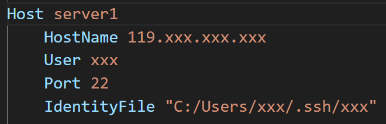

## 博士生成长之路 Path to A Senior PhD
---
### 欢迎大家补充和交流

---
### 一、动机 motivation

---

#### “要不要读博士”，是一个非常**重要**和**严肃**的问题。
<u>对于这个问题，不管你的答案是什么，也请你看完这个小节的内容。也许我的观点不算正确，但也希望或多或少地能帮助到你。</u>

读博是一个漫长的过程，对于直博的同学需要度过5-6年，对于硕士毕业接着读博的同学也是4-5年的日子。这段时间往往占据了一半的青春时光（20-30岁），这可是人生最美好的年华。所以，在思考这个问题和做出自己的决定前，请慎之又慎。在决定这个问题的答案时，请遵从自己内心的声音，思考以下问题：

#### 1. 我的性格和能力适合读博士？
- **选择适合自己性格的道路**：我们需要意识到这个世界上每个人都有不一样的性格，不同性格也适合干不一样的工作或事业。所以，不是所有人都适合科研的道路，而且科研也不会比其他行业更加高尚，选择适合自己性格的工作或事业才是让人生过得开心、快乐和充实的根本。
  - 举一个真实的例子吧，他是我这么多年以来第一次碰见的和我一个姓的同学，他非常喜欢游戏，对很多不同类型的游戏都非常了解，他从电子科大毕业后，那一年入学我们组的硕士，导师安排他做一个医学图像的项目，几个月之后，他找到我说他非常的痛苦和焦虑，因为自己觉得很煎熬而且进展也不顺利，我便开导他说不是所有人都适合搞科研，更不是科研要比其他行业更加高尚，忽略周围的噪声，认真思考适合你性格的道路。最后，他转成授课型硕士，1年半硕士毕业后去了网易游戏策划，他家也在广州，后来和他聊天也可以真切感受到他那种发自心底的笑容，也非常为他开心。
  - 总结下，大概就是“性格+选择=人生”，意思是说你的性格和你的选择将直接决定你的人生是否快乐，我想应该没有人想让自己的人生一直在痛苦和折磨中度过吧。

- **不骄不躁的心境和严谨认真的态度**：我认为这是读博所需要的两个最重要的性格。长达5年的时间里，你将经历：自己的论文屡次被拒，自己的想法被别人指指点点，自己的想法已经被同行做出来了，同学屡次中了好论文和奖学金，同学拿到了你梦寐以求的大厂实习，同学找到了150W年薪的工作……
  - 不骄不躁的心境，指的是一种能以**平常心**对待生活中起起伏伏的心境。我非常喜欢岳阳楼记里“不以物喜，不以己悲”这句词，表达的是不因事物好坏而悲喜的人生态度。做研究和读博士是一个周期非常长的事情，当你能做到不骄不躁的时候，也就意味着你能够时刻保持自己的步伐。也许你并没有意识到自己在默默地前进，但是等你有一天真正达到那一个（阶段性）的目标时，你会怎么样？开心是一定的，但是你应该会淡然地继续前进！反之亦然。
  - 严谨认真的态度，指的是能够对待工作和生活中的**大小事**都认真严谨。这不仅仅体现在学习或者工作上，也体现在生活上。我想大家应该都不愿意和不靠谱的人合作或者交朋友吧。举一个真实的例子吧，他是当年我们组的硕士，他在第三年冬季拿到了另外一个大学的博士录取，大学和地理位置都很好，之后3月份的时候，他在硕士毕业论文还没有写的情况下，和导师商量想要一个月以后安排毕业答辩，这样能赶上春季的毕业典礼。结果可想而知，他被导师拒绝了，并发生了不必要的争执。总结下，如果一个人没有严谨认真的学习或者工作态度，会给自己的合作者或朋友不再赏识你，从而错失了很多很好的机会。
  - 总结下，不骄不躁的心境是希望你能尽量远离生活中的焦虑，从容快乐地度过自己的人生；严谨认真的态度是希望你做一个靠谱的人，在人生道路上结交更多益友，为自己争取到更多更好的机会。


#### 2. 我读博士是为了什么？

- **正确的目的**
  - 我发自内心地想挑战一下，而不是出于虚荣心（下面会提到）。我决定读博之后能有坚持下去的勇气，既然选择了就坚持把这件事做完做好。
  - 我喜欢（至少不反感）这个行业，想要在这个行业有更深入的发展。
- **错误的目的**
  - 出于虚荣心，例如：“所谓的” 更好的工作、更高的薪水、更光明的未来，家人和朋友都觉得读博很牛，身边的朋友都读博了等等。统计学上有一个概念叫**幸存者偏差**，简而言之就是只看到了生存者的成功，而无法看到那些失败者的故事。众多博士毕业生们最后成为行业大牛的微乎其微，大多数人还是做着普通平凡（不是碌碌无为）的工作。如果你要问“为什么不可以是我成为行业大牛？”这样的问题，那么你可能还没有做好读博士的准备和成为大牛必备的素质，读博期间你会很焦虑甚至崩溃也是大概率会发生的。
  - 出于试试的心态。人生确实应该多尝试不同的选择，但是我想说这是建立在你对自己的性格有清晰的认识之上的。读博的过程是需要坚持的，特别是在有大量的代码和实验需要完成的时候，写论文有很多麻烦事情的时候，发现自己的收入和硕士毕业工作的同学比少的可怜的时候。如果只是以试试的心态，那么结局注定是无疾而终，与其浪费时间，不如尝试点更适合自己的事情。举一个真实的例子吧，他是当年另一个老师组的硕士生，一直在犹豫要不要读博士，于是先硕士毕业了，但是正值yq放开，就业市场异常萧条，于是选择继续读博了。1年之后，他告诉我读博士又累又穷，准备退学去找工作了。

#### 3. 我能接受最坏的结果吗？

- **能不能毕业和要不要毕业是两个完全不一样的问题**：很多同学会理想化地觉得我应该早点毕业，不需要4-5年，这样能早点拿到学位然后摆脱穷苦的日子。但是，他们太过于理想化现实了，忽略了一个非常关键问题，能不能毕业和要不要毕业是两个完全不一样的问题。
  - 能不能毕业，指的是说有没有达到学校或者导师的博士毕业要求。这一点在问题1中提到了，在决定读不读博之前要对自己性格有深入的分析，其中也包括自己的学习能力。如果你能考上国内的重点大学，那么证明你的能力一般来说是足够满足毕业要求的。从我的经历来看，如果你有严谨认真的工作态度，那么即使你的能力稍微差点，也能达到毕业要求。
  - 要不要毕业，指的是我毕业之后在就业市场有没有足够的竞争力。很多刚开始读博的同学会想当然的以为尽早毕业，能早点找工作。但是，他们忽视了和你们竞争工作岗位的大概率是读了5年以上，甚至还有博后的一群人。他们的成果往往比你更多，所以早毕业往往意味着成果不如那一群人，找工作的过程中只能占据下峰。所以，选择合适的时间毕业，才是正确的选择，这也是为什么大部分人都需要读至少4-5年的博士。
- 总结下，要想好自己能不能接受花费的这5年青春所得到的最差结果（例如多次延期毕业，毕业时成果不多，找到的工作一般，持续单身等）。


#### 4. 如果你看到这里还没有被我劝退，那么恭喜你，你已经成功迈出了第一步！

---
### 二、科研必备技能 research skills

#### 1. 代码

- **VSCode相关**
  - [VSCode](https://zhuanlan.zhihu.com/p/675265926)几乎集成了所有写代码所需要的功能。下面列举几个常用的功能：
    - **ssh远程连接**（插件：Remote-SSH, Remote - SSH: Editing Configuration Files, Remote Explorer）。在Remote Explorer的config文件中，可以配置对应的格式。
      - 
    - **代码自动格式化**（插件：Black Formatter）。**代码整齐是非常有必要的好习惯**，能够降低bug的出现概率，也方便自己理解和查找所写的代码，提高效率。shift+ctrl+p之后，输入“format with ...”，就能设置每次保存文件后自动格式化代码。
    - **markdown**（插件：Markdown All in One）。非常推荐用markdown写文档，原因在于可以方便地插入公式、图片和表格，同时可以通过插件很方便地转化为html、pdf等格式。
    - **github**（自带GitHub，插件：GitHub Copilot）。VSCode本身自带GitHub，需要本地配置git环境（windows和mac的配置方式不一样）。GitHub Copilot能自动根据上下文联想代码，能够节省很多时间，特别是写重复代码的时候（需要付费，10 USD/月）。同时，需要学习git常用的命令，例如git clone, git clone, git config, git commit, git push等，但是VSCode有图形界面能够把代码push到仓库中，比较方便。
    - **project page**作为项目的展示界面，可以在代码仓库中单独创建```docs/index.html```来

- **Linux系统相关**
  - [命令行大全](https://zhuanlan.zhihu.com/p/420247468)，以下列举常用的命令：
    - cd, ls, mkdir, rm, top, htop, mv, cp, nohup, df, pwd
    - scp, rsync, tar, zip, wget, vim
    - ps, kill, pkill
    - tmux, watch, nvidia-smi
    - **需要熟练掌握以上每一个命令行的用处**。由于有些命令比较复杂，建议在自己的文档里把常用的命令模板加上，例如“rsync -avP -e "ssh -i C:/Users/xxx/.ssh/xxx" ./amass* xxx@119.xxx.xxx.xxx:/data”。这样能够提高工作效率。
  - python的安装与使用（conda的虚拟环境管理）
    - 选择安装[miniconda](https://blog.csdn.net/m0_73625420/article/details/128313467)，较为节省空间。然后使用conda创建若干个虚拟环境。
    - conda与pip安装模块的区别：conda能够自动匹配合适的模块版本，pip只默认安装最新的模块版本。所以尽量使用conda install来安装模块，如果没有比如opencv-python，可以再用pip install。
    - conda安装torch时，可以选择对应的cuda版本，因为conda在安装torch时会同时安装cuda，所以安装时选择好对应的cuda版本。其次，pytorch3d的安装也可以通过conda，从而避免版本冲突导致的无法使用的问题。而pip是没法做到这一点的。
  - docker
- **Latex相关**
  - Overleaf
  - 公式编写
  - 文献管理
  - 图和表格

#### 2. 文档

- 课程学习文档
- 论文阅读文档
- 实验日志文档

#### 3. PPT

- 画论文中的插图
- 做汇报
  - 如何做学术报告幻灯片 [[Link]](https://pengsida.notion.site/slides-810f02670691444f8c94cc3d5b76dcbc)

#### 4. 课程

#### 5. 英语

---
### 培养科研能力 research capability

科研能力

入门3D Vision的科研[[Link]](https://github.com/pengsida/learning_research/blob/master/getting_started_in_research.md)

博士生应该具有的能力、如何锻炼这些能力、如何做科研项目[[Link]](https://github.com/pengsida/learning_research/blob/master/getting_advanced_in_research.md)[[link]](https://pengsida.notion.site/research-project-b43507ef26d044bd888ac29f4736e116)

---
### 四、论文撰写 paper writing

论文写作模板[[Link]](https://pengsida.notion.site/c1a22465a0fa4b15a12985223916048e)


---
### 参考文档 Reference
[1] [Learning Research by Sida Peng from ZJU](https://github.com/pengsida/learning_research)

