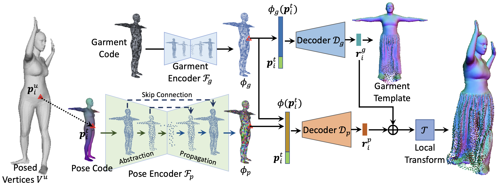
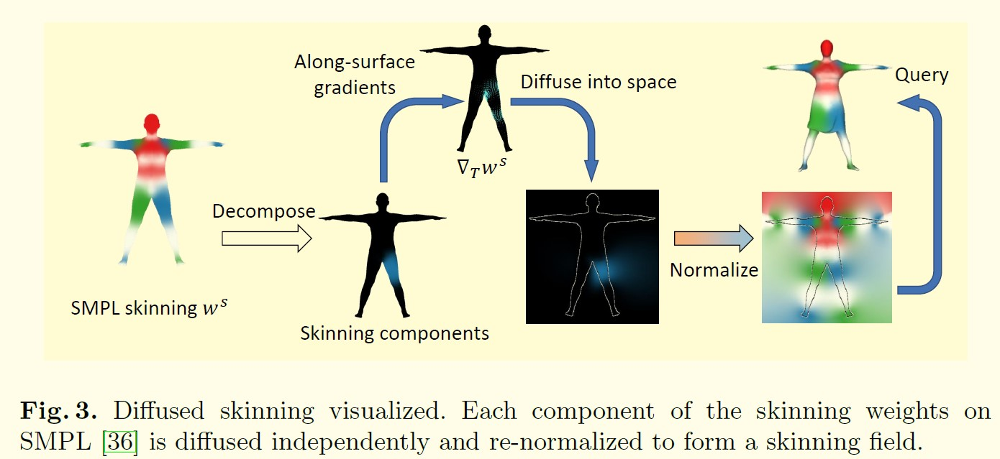
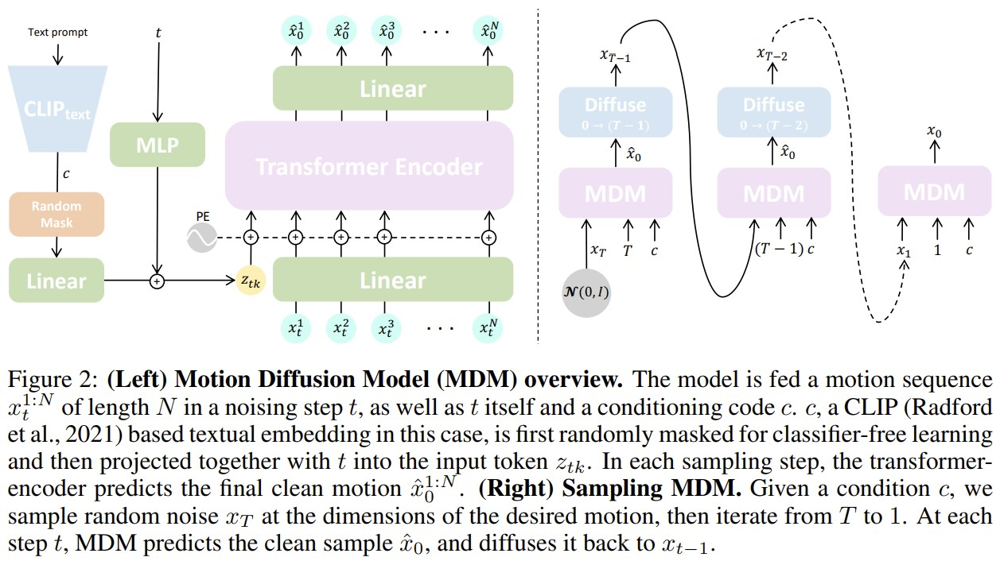

# Blog Human Shape Reconstruction

## Contents

 - [From Pointcloud](#from-pointcloud)
 - [From Multi-view RGBD](#from-multi-view-rgbd)
 - [From Multi-view RGB](#from-multi-view-rgb)
 - [Diffusion Modles](#diffusion-models)
 - [Resources](#resources)

---

## From Pointcloud

### [CVPR 2023] CloSET: Modeling Clothed Humans on Continuous Surface with Explicit Template Decomposition [[pdf]](http://www.liuyebin.com/closet/)
_Hongwen Zhang, Siyou Lin, Ruizhi Shao, Yuxiang Zhang, Zerong Zheng, Han Huang, Yandong Guo, Yebin Liu_

- In this paper, we revisit point-based solutions and propose to decompose explicit garment-related templates and then add pose-dependent wrinkles to them.
- Additionally, to tackle the seam artifact issues in recent state-of-the-art point-based methods, we propose to learn point features on a body surface, which establishes a continuous and compact feature space to capture the fine-grained and pose-dependent clothing geometry.
- In THuman-CloSET, there are more than 2,000 scans of 15 outfits with a large variation in clothing style, including T-shirts, pants, skirts, dresses, jackets, and coats, to name a few.

### [NeurIPS 2021] Garment4D: Garment Reconstruction from Point Cloud Sequences [[pdf]](https://arxiv.org/abs/2112.04159)[[code]](https://github.com/hongfz16/Garment4D)
_Fangzhou Hong, Liang Pan, Zhongang Cai, Ziwei Liu_

- we propose a principled framework, Garment4D, that uses 3D point cloud sequences of dressed humans for garment reconstruction.
- Firstly, 3D inputs eliminate scale and pose ambiguities that are difficult to avoid when using 2D images. Secondly, exploiting temporal information is important for garment dynamics capturing, at which there are few attempts. Thirdly, recent development in 3D sensors (e.g. LiDAR) has reduced the cost and difficulties in obtaining point clouds, which makes it easier to leverage 3D point clouds for research problems and commercial applications.
- CLOTH3D is a large scale synthetic dataset with rich garment shapes and styles and abundant human pose sequences. We sample point sets from 3D human models to produce the point cloud sequence inputs.

### [ICCV 2021] The Power of Points for Modeling Humans in Clothing [[pdf]](https://arxiv.org/abs/2109.01137)[[code]](https://qianlim.github.io/POP)
_Qianli Ma, Jinlong Yang, Siyu Tang, Michael J. Black_

### [ECCV 2022] Learning Implicit Templates for Point-based Clothed Human Modeling [[pdf]](https://arxiv.org/abs/2207.06955)[[code]](https://github.com/jsnln/fite)
_Siyou Lin, Hongwen Zhang, Zerong Zheng, Ruizhi Shao, Yebin Liu_

- Our framework first learns implicit surface templates representing the coarse clothing topology, and then employs the templates to guide the generation of point sets which further capture pose-dependent clothing deformations such as wrinkles.
- Our task is to learn animatable clothed human avatars with realistic posedependent clothing deformations from a set of posed scans, under a multi-outfit setting.

### [3DV 2022] Neural Point-based Shape Modeling of Humans in Challenging Clothing [[pdf]](https://arxiv.org/abs/2209.06814)[[code]](https://qianlim.github.io/SkiRT)
_Qianli Ma, Jinlong Yang, Michael J. Black, Siyu Tang_

### [CVPR 2021] SCANimate: Weakly supervised learning of skinned clothed avatar networks [[pdf]](https://arxiv.org/abs/2104.03313)
_Shunsuke Saito, Jinlong Yang, Qianli Ma, and Michael J Black_
  

[[back to top]](#contents)

---
## From Multi-view RGBD

### [SIGGRAPH 2023] AvatarReX: Real-time Expressive Full-body Avatars [[pdf]](https://liuyebin.com/AvatarRex/)
_Zerong Zheng, Xiaochen Zhao, Hongwen Zhang, Boning Liu, Yebin Liu_

### [ICCV 2021] DeepMultiCap: Performance Capture of Multiple Characters Using Sparse Multiview Cameras [[pdf]](http://www.liuyebin.com/dmc/dmc.html)[[code]](https://github.com/DSaurus/DeepMultiCap/tree/main)
_Yang Zheng, Ruizhi Shao, Yuxiang Zhang, Tao Yu, Zerong Zheng, Qionghai Dai, Yebin Liu._
- To tackle with the serious occlusion challenge for close interacting scenes, we combine a recently proposed pixelaligned implicit function with parametric model for robust reconstruction of the invisible surface areas.
- With estimated SMPL models and segmented multi-view, we design a spatial attentionaware network and temporal fusion method to reconstruct each character separately.

[[back to top]](#contents)

---
## From (multi-view) RGB
### [CVPR 2019] PIFu: Pixel-Aligned Implicit Function for High-Resolution Clothed Human Digitization [[pdf]](https://arxiv.org/pdf/1905.05172.pdf)
_Shunsuke Saito, Zeng Huang, Ryota Natsume, Shigeo Morishima, Angjoo Kanazawa, Hao Li_
- We propose a new Pixel-aligned Implicit Function (PIFu) representation for 3D deep learning for the challenging problem of textured surface inference of clothed 3D humans from a single or multiple input images.
- We sample points using a mixture of uniform volume samples and importance sampling around the surface using Gaussian perturbation around uniformly sampled surface points.

### [CVPR 2020] PIFuHD: Multi-Level Pixel-Aligned Implicit Function for High-Resolution 3D Human Digitization [[pdf]](https://shunsukesaito.github.io/PIFuHD/)
_Shunsuke Saito, Tomas Simon, Jason Saragih, Hanbyul Joo_
- Unlike voxel-based methods, PIFu does not produce a discretized volume as output, so training can be performed by sampling 3D points and computing the occupancy loss at the sampled locations, without generating 3D meshes. During inference, 3D space is uniformly sampled to infer the occupancy and the final iso-surface is extracted with a threshold of 0.5 using marching cubes
- Since curvature is the second-order derivative of surface geometry, importance sampling based on curvature significantly enhances details and fidelity.

### [CVPR 2022] DoubleField: Bridging the Neural Surface and Radiance Fields for High-fidelity Human Reconstruction and Rendering [[pdf]](http://www.liuyebin.com/dbfield/dbfield.html)
_Ruizhi Shao, Hongwen Zhang, He Zhang, Mingjia Chen, Yanpei Cao, Tao Yu, Yebin Liu_
- We introduce DoubleField, a novel framework combining the merits of both surface field in PIFu and radiance field in PixelNeRF for high-fidelity human reconstruction and rendering.
- The surface-guided sampling strategy will determine the intersection points in the surface field at first and then perform fine-grained sampling around the intersected surface.
- view-to-view transformer adopts an encoder-decoder architecture that leverages the observations of the point x from all input views, and more importantly, the direction dq of the query view to predict the color feature ec for view-dependent rendering.
- In the finetuning phase, the network takes the ultra-high-resolution images from the sparse multi-view of a specific human as input and finetune the network parameters in a self-supervised manner using differentiable rendering loss.

### [ECCV 2022] DiffuStereo: High Quality Human Reconstruction via Diffusion-based Stereo Using Sparse Cameras [[pdf]](http://www.liuyebin.com/diffustereo/diffustereo.html)
_Ruizhi Shao, Zerong Zheng, Hongwen Zhang, Jingxiang Sun, Yebin Liu._
- We design a new diffusion kernel and additional stereo constraints to facilitate stereo matching and depth estimation in the network. Given a set of sparse-view color images of a human, the proposed multi-level diffusion-based stereo network can produce highly accurate depth maps, which are then converted into a high-quality 3D human model through an efficient multi-view fusion strategy.
-  Specifically, our diffusion-based stereo contains a forward process and a reverse process to obtain the final high-quality disparity map. In the forward process, the initial disparity maps are diffused to the maps with noise distribution. In the reverse process, the high-quality disparity maps will be recovered from the noisy maps with the condition of several stereo-related features.
- The final mesh can be reconstructed from the final point cloud pf using Poisson Reconstruction. (Poisson surface reconstruction)

[[back to top]](#contents)

---
## Diffusion Model

### This repository contains a collection of resources and papers on Diffusion Models. [[code]](https://github.com/heejkoo/Awesome-Score-based-Diffusion-Models)

### [NeurIPS 2020] Denoising Diffusion Probabilistic Models [[pdf]](https://arxiv.org/abs/2006.11239)
_Jonathan Ho, Ajay Jain, Pieter Abbeel_

### [arXiv 2022] Diffusion Models: A Comprehensive Survey of Methods and Applications [[pdf]](https://arxiv.org/pdf/2209.00796.pdf)
_Ling Yang, Zhilong Zhang, Yang Song, Shenda Hong, Runsheng Xu, Yue Zhao, Wentao Zhang, Bin Cui, Ming-Hsuan Yang_

### [CVPR 2022] High-Resolution Image Synthesis with Latent Diffusion Models [[code]](https://github.com/CompVis/stable-diffusion) [[pdf]](https://openaccess.thecvf.com/content/CVPR2022/papers/Rombach_High-Resolution_Image_Synthesis_With_Latent_Diffusion_Models_CVPR_2022_paper.pdf) [[supp]](https://openaccess.thecvf.com/content/CVPR2022/supplemental/Rombach_High-Resolution_Image_Synthesis_CVPR_2022_supplemental.pdf)
_Robin Rombach, Andreas Blattmann, Dominik Lorenz, Patrick Esser, Björn Ommer_
- However, since these models typically operate directly in pixel space, optimization of powerful DMs often consumes hundreds of GPU days and inference is expensive due to sequential evaluations. To enable DM training on limited computational resources while retaining their quality and flexibility, we apply them in the latent space of powerful pretrained autoencoders.

### [ICLR 2023] MDM: Human Motion Diffusion Model [[code]](https://guytevet.github.io/mdm-page/)
_Guy Tevet, Sigal Raab, Brian Gordon, Yonatan Shafir, Daniel Cohen-Or, Amit H. Bermano_

### Blog: What are Diffusion Models? [[project]](https://lilianweng.github.io/posts/2021-07-11-diffusion-models/)

[[back to top]](#contents)

---
## Resources

### Volumetric TSDF Fusion of RGB-D Images in Python [[code]](https://github.com/andyzeng/tsdf-fusion-python)

### THUman5.0 dataset [[code]](https://github.com/DSaurus/DiffuStereo/blob/master/DATASET.md)

### A Large-Scale Semantic and Emotional Multi-Modal Dataset for Conversational Gestures Synthesis 

### HuMMan: Multi-Modal 4D Human Dataset for Versatile Sensing and Modeling [[project]](https://caizhongang.github.io/projects/HuMMan/)

[[back to top]](#contents)

---