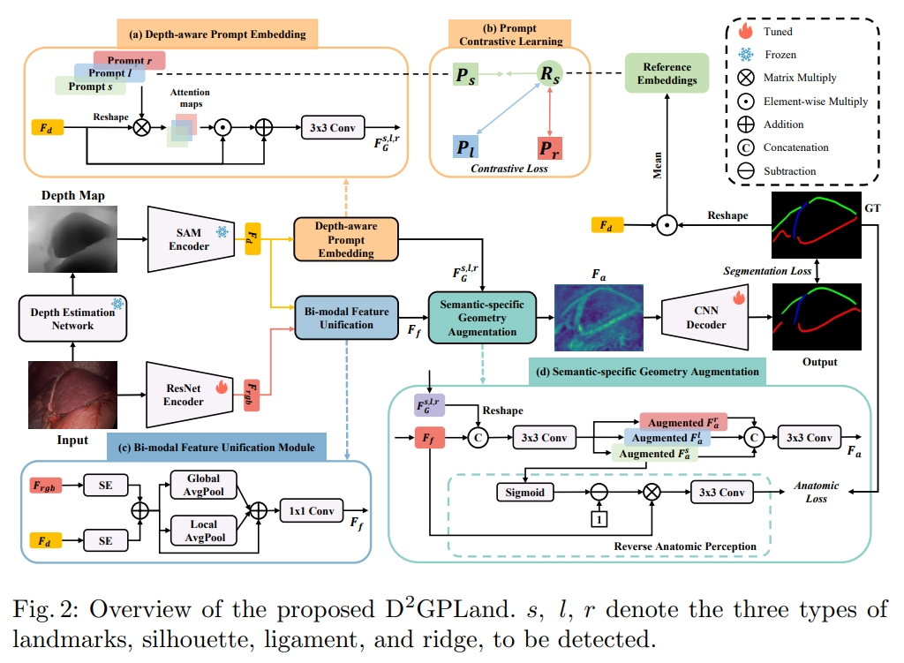

# Blog Medical Image AI Related

---
## Contents
 - [Medical Image AI](#medical-image-ai)

---

## Medical Image AI

### [Nature Biomedical Engineering 2017] Surgical data science for next-generation interventions [[PDF]](https://www.nature.com/articles/s41551-017-0132-7)
_Lena Maier-Hein, Swaroop S. Vedula, Stefanie Speidel, Nassir Navab, Ron Kikinis, Adrian Park, Matthias Eisenmann, Hubertus Feussner, Germain Forestier, Stamatia Giannarou, Makoto Hashizume, Darko Katic, Hannes Kenngott, Michael Kranzfelder, Anand Malpani, Keno März, Thomas Neumuth, Nicolas Padoy, Carla Pugh, Nicolai Schoch, Danail Stoyanov, Russell Taylor, Martin Wagner, Gregory D. Hager & Pierre Jannin_

### [MICCAI 2024] Depth-Driven Geometric Prompt Learning for Laparoscopic Liver Landmark Detection [[PDF]](https://www.arxiv.org/abs/2406.17858)
_Jialun Pei, Ruize Cui, Yaoqian Li, Weixin Si, Jing Qin, Pheng-Ann Heng_
- 

### Multi-resolution 3d convolutional neural networks for automatic coronary centerline extraction in cardiac ct angiography scans

### Coronary artery centerline extraction in cardiac ct angiography using a cnn-based orientation classifier [[code]](https://github.com/BubblyYi/Coronary-Artery-Tracking-via-3D-CNN-Classification)

### VesselNet: A deep convolutional neural network with multi pathways for robust hepatic vessel segmentation

### DeepVesselNet: Vessel Segmentation, Centerline Prediction, and Bifurcation Detection in 3-D Angiographic Volumes

---

## surgical segmentation

### [MICCAI 2020] ISINet: An Instance-Based Approach for Surgical Instrument Segmentation

### [NeurIPS 2023] Text Promptable Surgical Instrument Segmentation with Vision-Language Models [[PDF]](https://arxiv.org/pdf/2306.09244)
- Our model leverages multiple text prompts for each surgical instrument through a new mixture of prompts mechanism, resulting in enhanced segmentation performance. Additionally, we introduce a hard instrument area reinforcement module to improve image feature comprehension and segmentation precision.
- Comparison between our method and other state-of-the-art methods on the EndoVis2018
dataset. 7 predefined instrument categories (bipolar forceps, prograsp forceps, large needle driver, monopolar curved scissors, ultrasound probe, suction instrument, clip applier).

### [arXiv 2023] AdaptiveSAM: Towards Efficient Tuning of SAM for Surgical Scene Segmentation
- We propose AdaptiveSAM - an adaptive modification of SAM that can adjust to new datasets quickly and efficiently, while enabling text-prompted segmentation.
- report the average object-wise DICE Scores and IoU scores across the four test datasets
- RESULTS ON ENDOVIS 18. BG TISSUE - BACKGROUND TISSUE, RI - ROBOTIC INSTRUMENT, KP - KIDNEY PARENNCHYMA, CK - COVERED KIDNEY, SN - SUTURING NEEDLE, SUCTION INS. - SUCTION INSTRUMENT, S. INTESTINE - SMALL INTESTINE, UP - ULTRASOUND PROBE
- RESULTS ON ENDOVIS17. PF - PROGRASP FORCEPS, BF - BIPOLAR FORCEPS, LND - LARGE NEEDLE DRIVER, GR - GRASPING RETRACTOR, VS - VESSEL SEALER, MCS - MONOPOLAR CURVED SCISSORS

### [TMI 2024] Video-instrument synergistic network for referring video instrument segmentation in robotic surgery
- This work explores a new task of Referring Surgical Video Instrument Segmentation (RSVIS), which aims to automatically identify and segment the corresponding surgical instruments based on the given language expression.

### [TIP 2024] Boundary-Aware Prototype in Semi-Supervised Medical Image Segmentation
- Inspired by this, we propose a novel consistency learning framework based on the non-parametric distance metric of boundary-aware prototypes to alleviate this problem.
- Boundary-Aware Prototype Segmentation
- LA Dataset, Pancreas-NIH Dataset

### [arXiv 2023] Medical SAM Adapter: Adapting Segment Anything Model for Medical Image Segmentation
- following the official ViT-H SAM GitHub repository
- For the REFUGE2, TNMIX, and ISIC datasets, we trained the model for 40 epochs. For the BTCV and BraTs datasets, we extended the training to 60 epochs.

### [AAAI 2024] SurgicalSAM: Efficient Class Promptable Surgical Instrument Segmentation
- To address these problems, we introduce SurgicalSAM, a novel end-to-end efficient-tuning approach for SAM to effectively integrate surgical-specific information with SAM's pre-trained knowledge for improved generalisation. Specifically, we propose a lightweight prototype-based class prompt encoder for tuning, which directly generates prompt embeddings from class prototypes and eliminates the use of explicit prompts for improved robustness and a simpler pipeline. In addition, to address the low inter-class variance among surgical instrument categories, we propose contrastive prototype learning, further enhancing the discrimination of the class prototypes for more accurate class prompting. 
- The results of extensive experiments on both EndoVis2018 and EndoVis2017 datasets demonstrate that SurgicalSAM achieves state-of-the-art performance while only requiring a small number of tunable parameters.

### [NeurIPS 2024 Workshop] Surgical SAM 2: Real-time segment anything in surgical video by efficient frame pruning [[PDF]](https://arxiv.org/pdf/2408.07931)
- we introduce Surgical SAM 2 (SurgSAM2), an advanced model to utilize SAM2 with an Efficient Frame Pruning (EFP) mechanism, to facilitate real-time surgical video segmentation.

### [arXiv 2024] Medical SAM 2: Segment medical images as video via Segment Anything Model 2 [[PDF]](https://arxiv.org/pdf/2408.00874)
- memory-enhanced medical image segmentation

### [Nature Method 2023 Comment] Towards foundation models of biological image segmentation

### [MIA 2025] Medical SAM Adapter: Adapting Segment Anything Model for Medical Image Segmentation [[PDF]](https://www.sciencedirect.com/science/article/pii/S1361841525000945)
- The main challenges in medical image segmentation lie in 3D image processing and the ambiguous boundaries between overlapped organs. 
- We also propose Space-Depth Transpose (SD-Trans) to adapt 2D SAM to 3D medical images and Hyper-Prompting Adapter (HyP-Adpt) to achieve prompt-conditioned adaptation

### [CVPR 2024] One-Prompt to Segment All Medical Images [[PDF]](https://openaccess.thecvf.com/content/CVPR2024/papers/Wu_One-Prompt_to_Segment_All_Medical_Images_CVPR_2024_paper.pdf)
- We train One-Prompt Model on 64 open-source medical datasets, accompanied by the collection of over 3,000 clinician-labeled prompts. Tested on 14 previously unseen datasets, the One-Prompt Model showcases superior zero-shot segmentation capabilities, outperforming a wide range of related methods.

### [AAAI 2024] Medsegdiff-v2: Diffusion based medical image segmentation with transformer
- We propose a novel Spectrum-Space Transformer (SS-Former). Our key idea is to learn the interaction of condition semantic feature and diffusion noise feature in the frequency domain. 

### [TMI 2022] Exploring Intra- and Inter-Video Relation for Surgical Semantic Scene Segmentation
- We use a public challenge dataset from 2018 MICCAI Robotic Scene Segmentation Challenge, referred to as EndoVis18 [4]. The dataset parses the entire surgical scene into 12 classes, including different anatomy and robotic instruments.

### [Nature Communications 2024] Segment Anything in Medical Images
- The model is developed on a large-scale medical image dataset with 1,570,263 image-mask pairs, covering 10 imaging modalities and over 30 cancer types. We conduct a comprehensive evaluation on 86 internal validation tasks and 60 external validation tasks, demonstrating better accuracy and robustness than modality-wise specialist models.

---

## Survey

### [arXiv 2024] Segment Anything Model for Medical Image Segmentation: Current Applications and Future Directions

---
