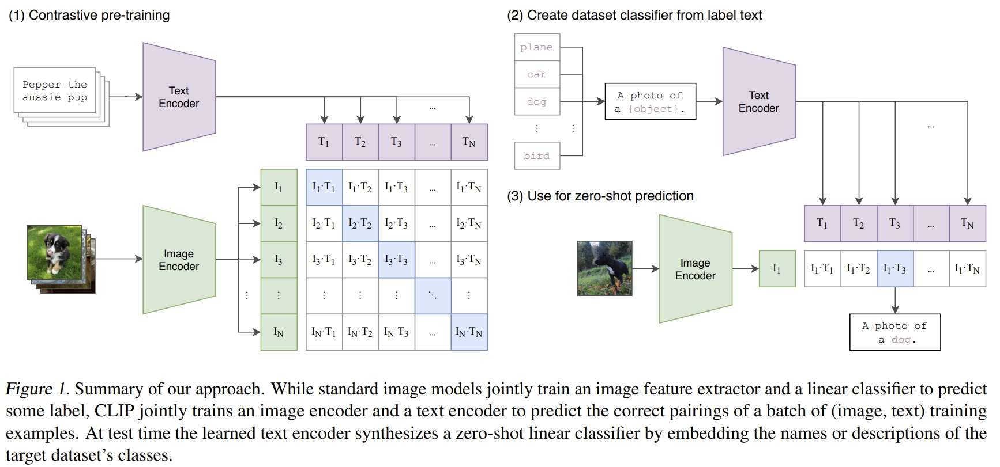
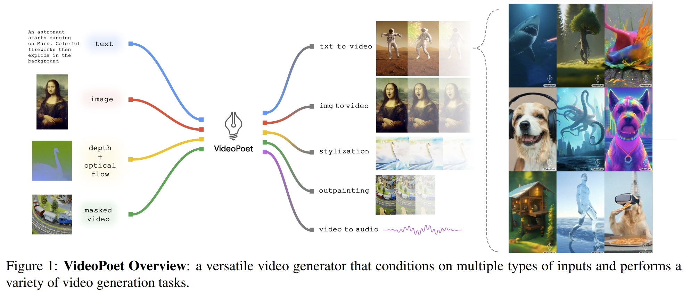
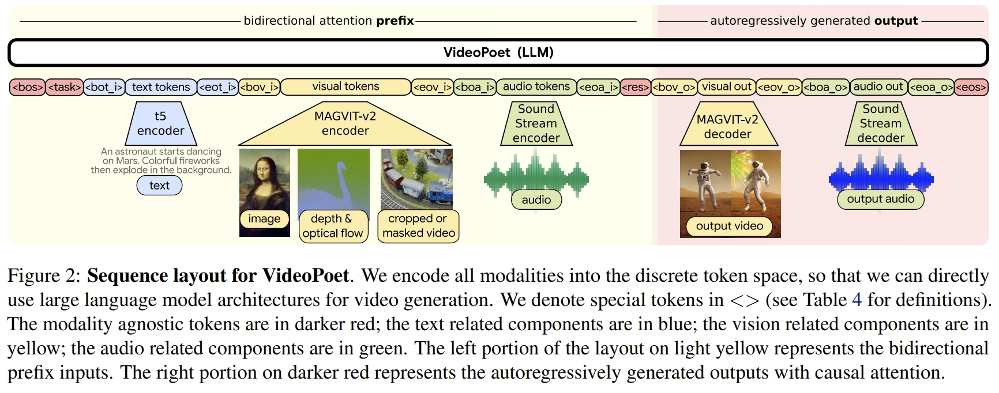
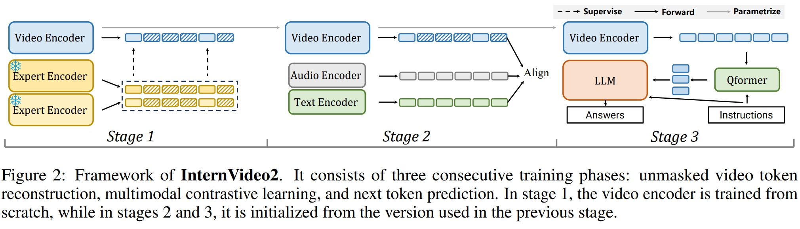

# Blog Generative Models Related

---
## Contents
 - [Fundation Models](#fundation-models)
 - [Human Animation](#human-animation)

---
## Summary of multi-modal alignment methods

- video-text contrastive learning
- masked video modeling
- next token prediction
- a joint visual-audio-text representation 
- knowledge distill

---
## Some Popular Papers

#### Efficiently Modeling Long Sequences with Structured State Spaces [[pdf]](https://arxiv.org/pdf/2111.00396)
_Albert Gu, Karan Goel, and Christopher R´e_

#### Mamba: Linear-Time Sequence Modeling with Selective State Spaces [[pdf]](https://arxiv.org/pdf/2312.00752) [[blog]](https://newsletter.maartengrootendorst.com/p/a-visual-guide-to-mamba-and-state)
_Albert Gu and Tri Dao_
- State Space Model (SSM)
- This model is referred to as the Linear State-Space Layer (LSSL). These representations share an important property, namely that of Linear Time Invariance (LTI). LTI states that the SSMs parameters, A, B, and C, are fixed for all timesteps. This means that matrices A, B, and C are the same for every token the SSM generates.
- 
- 
- Structured State Space for Sequences (S4)
- SSMs + HiPPO (matrix) for handling long-range dependencies + Discretization for creating recurrent and convolution representations
- Mamba: A Selective SSM
- This means that for every input token, we now have different B and C matrices which solves the problem with content-awareness! Matrix A remains the same since we want the state itself to remain static but the way it is influenced (through B and C) to be dynamic.
- 
- Parallelization, in contrast, seems impossible since each state can only be calculated if we have the previous state. Mamba, however, makes this possible through the parallel scan algorithm.
- 
- 
- 

#### KAN: Kolmogorov–Arnold Networks [[pdf]](https://arxiv.org/pdf/2404.19756)
- While MLPs place fixed activation functions on nodes (“neurons”), KANs place learnable activation functions on edges (“weights”).
- 
- Vladimir Arnold and Andrey Kolmogorov established that if f is a multivariate continuous function on a bounded domain, then f can be written as a finite composition of continuous functions of a single variable and the binary operation of addition.

---
## Fundation Models

### [!!!] [Meta AI] Segment Anything [[pdf]](https://arxiv.org/abs/2304.02643)
_Alexander Kirillov, Eric Mintun, Nikhila Ravi, Hanzi Mao, Chloe Rolland, Laura Gustafson, Tete Xiao, Spencer Whitehead, Alexander C. Berg, Wan-Yen Lo, Piotr Dollár, Ross Girshick_
- We take inspiration from NLP, where the next token prediction task is used for foundation model pre-training and to solve diverse downstream tasks via prompt engineering.
- Task generalization vs multi-task segmentation
- MAE pre-trained Vision Transformer (ViT)
- The data engine has three stages: (1) a model-assisted manual annotation stage, (2) a semi-automatic stage with a mix of automatically predicted masks and model-assisted annotation, and (3) a fully automatic stage in which our model generates masks without annotator input.
- Specifically, we prompt SAM to (1) perform edge detection, (2) segment everything, i.e. object proposal generation, (3) segment detected objects, i.e. instance segmentation, and (4), as a proof-of-concept, to segment objects from free-form text. These four tasks differ significantly from the promptable segmentation task that SAM was trained on and are implemented via prompt engineering.
- 
- 

### [!!!] [Meta AI] SAM 2: Segment Anything in Images and Videos [[PDF]](https://arxiv.org/pdf/2408.00714)
_Nikhila Ravi, Valentin Gabeur, Yuan-Ting Hu, Ronghang Hu, Chaitanya Ryali, Tengyu Ma, Haitham Khedr, Roman Rädle, Chloe Rolland, Laura Gustafson, Eric Mintun, Junting Pan, Kalyan Vasudev Alwala, Nicolas Carion, Chao-Yuan Wu, Ross Girshick, Piotr Dollár, Christoph Feichtenhofer_

### [!!!] [arXiv 2024] Stable Video Diffusion: Scaling Latent Video Diffusion Models to Large Datasets [[pdf]](https://arxiv.org/abs/2311.15127)
_Andreas Blattmann, Tim Dockhorn, Sumith Kulal, Daniel Mendelevitch, Maciej Kilian, Dominik Lorenz, Yam Levi, Zion English, Vikram Voleti, Adam Letts, Varun Jampani, Robin Rombach_
- In this paper, we identify and evaluate three different stages for successful training of video LDMs: text-to-image pretraining, video pretraining, and high-quality video finetuning. 
- We demonstrate the necessity of a well-curated pretraining dataset.
- Our model provides a strong multi-view 3D-prior.
- Our model provides a powerful motion representation for downstream tasks such as image-to-video generation and adaptability to camera motion-specific LoRA modules.

### [!!!] [OpenAI] CLIP: Learning transferable visual models from natural language supervision [[pdf]](https://arxiv.org/abs/2103.00020)
_Alec Radford, Jong Wook Kim, Chris Hallacy, Aditya Ramesh, Gabriel Goh, Sandhini Agarwal, Girish Sastry, Amanda Askell, Pamela Mishkin, Jack Clark, Gretchen Krueger, Ilya Sutskever_
- 
- To address this, we constructed a new dataset of 400 million (image, text) pairs collected form a variety of publicly available sources on the Internet. To attempt to cover as broad a set of visual concepts as possible, we search for (image, text) pairs as part of the construction process whose text includes one of a set of 500,000 queries. We approximately class balance the results by including up to 20,000 (image, text) pairs per query. The resulting dataset has a similar total word count as the WebText dataset used to train GPT-2. We refer to this dataset as WIT for WebImageText.

### [ICML 2021] ALIGN: Scaling up visual and vision-language representation learning with noisy text supervision [[pdf]](https://arxiv.org/abs/2102.05918)
_Chao Jia, Yinfei Yang, Ye Xia, Yi-Ting Chen, Zarana Parekh, Hieu Pham, Quoc V. Le, Yunhsuan Sung, Zhen Li, Tom Duerig_

### [OpenAI] DALL-E: Zero-Shot Text-to-Image Generation [[pdf]](https://arxiv.org/abs/2102.12092)
_Aditya Ramesh, Mikhail Pavlov, Gabriel Goh, Scott Gray, Chelsea Voss, Alec Radford, Mark Chen, Ilya Sutskever_
- We created a dataset of a similar scale to JFT-300M by collecting 250 million text-images pairs from the internet
- Stage One: Learning the Visual Codebook
- Stage Two: Learning the Prior

### [OpenAI] Grokking: Generalization beyond Overfitting on Small Algorithmic Datasets [[pdf]](https://arxiv.org/pdf/2201.02177.pdf)
_Alethea Power, Yuri Burda, Harri Edwards, Igor Babuschkin, and Vedant Misra_

### [!!!] [Google Research] VideoPoet: A Large Language Model for Zero-Shot Video Generation [[pdf]](https://arxiv.org/abs/2312.14125) [[project]](https://sites.research.google/videopoet/)
_Dan Kondratyuk, Lijun Yu, Xiuye Gu, José Lezama, Jonathan Huang, Rachel Hornung, Hartwig Adam, Hassan Akbari, Yair Alon, Vighnesh Birodkar, Yong Cheng, Ming-Chang Chiu, Josh Dillon, Irfan Essa, Agrim Gupta, Meera Hahn, Anja Hauth, David Hendon, Alonso Martinez, David Minnen, David Ross, Grant Schindler, Mikhail Sirotenko, Kihyuk Sohn, Krishna Somandepalli, Huisheng Wang, Jimmy Yan, Ming-Hsuan Yang, Xuan Yang, Bryan Seybold, Lu Jiang_
- A pre-trained MAGVIT V2 video tokenizer and a SoundStream audio tokenizer transform images, video, and audio clips with variable lengths into a sequence of discrete codes in a unified vocabulary. 
- An autoregressive language model learns across video, image, audio, and text modalities to autoregressively predict the next video or audio token in the sequence.
- A mixture of multimodal generative learning objectives are introduced into the LLM training framework, including text-to-video, text-to-image, image-to-video, video frame continuation, video inpainting and outpainting, video stylization, and video-to-audio. Furthermore, such tasks can be composed together for additional zero-shot capabilities (e.g., text-to-audio).
- Datasets. We train on a total of 1B image-text pairs and ∼270M videos (∼100M with paired text, of which ∼50M are used for high-quality finetuning, and ∼170M with paired audio) from the public internet and other sources, i.e. around 2 trillion tokens across all modalities. The data has been filtered to remove egregious content and sampled to improve contextual and demographic diversity.
- 
- 

### [NeurIPS 2023] DaTaSeg: Taming a Universal Multi-Dataset Multi-Task Segmentation Model [[pdf]](https://arxiv.org/abs/2306.01736)
_Xiuye Gu, Yin Cui, Jonathan Huang, Abdullah Rashwan, Xuan Yang, Xingyi Zhou, Golnaz Ghiasi, Weicheng Kuo, Huizhong Chen, Liang-Chieh Chen, David A Ross_
- 

### [NeurIPS 2023] Module-wise Adaptive Distillation for Multimodality Foundation Models [[pdf]](https://arxiv.org/abs/2310.04550)
_Chen Liang, Jiahui Yu, Ming-Hsuan Yang, Matthew Brown, Yin Cui, Tuo Zhao, Boqing Gong, Tianyi Zhou_

### [NeurIPS 2023] Alternating Gradient Descent and Mixture-of-Experts for Integrated Multimodal Perception [[pdf]](https://arxiv.org/abs/2305.06324)
_Hassan Akbari, Dan Kondratyuk, Yin Cui, Rachel Hornung, Huisheng Wang, Hartwig Adam_
- IMP integrates multimodal inputs including image, video, text, and audio into a single Transformer encoder with minimal modality-specific components. IMP makes use of a novel design that **combines Alternating Gradient Descent (AGD) and Mixture-of-Experts (MoE) for efficient model & task scaling**. We conduct extensive empirical studies and reveal the following key insights: 1) performing gradient descent updates by alternating on diverse modalities, loss functions, and tasks, with varying input resolutions, efficiently improves the model. 2) sparsification with MoE on a single modalityagnostic encoder substantially improves the performance, outperforming dense models that use modality-specific encoders or additional fusion layers and greatly mitigates the conflicts between modalities.
- 

### [Shanghai AI Lab] InternVideo2: Scaling Video Foundation Models for Multimodal Video Understanding [[pdf]](https://arxiv.org/pdf/2403.15377.pdf) [[project]](https://github.com/OpenGVLab/InternVideo2)
_Yi Wang, Kunchang Li, Xinhao Li, Jiashuo Yu, Yinan He, Guo Chen, Baoqi Pei, Rongkun Zheng, Jilan Xu, Zun Wang, Yansong Shi, Tianxiang Jiang, Songze Li, Hongjie Zhang, Yifei Huang, Yu Qiao, Yali Wang, Limin Wang_
- explore the use of audio information in videos to improve performance
- 

---
## Video Transformer

### [ICLR 2024] Language Model Beats Diffusion -- Tokenizer is Key to Visual Generation [[pdf]](https://arxiv.org/abs/2310.05737)
_Lijun Yu, José Lezama, Nitesh B. Gundavarapu, Luca Versari, Kihyuk Sohn, David Minnen, Yong Cheng, Vighnesh Birodkar, Agrim Gupta, Xiuye Gu, Alexander G. Hauptmann, Boqing Gong, Ming-Hsuan Yang, Irfan Essa, David A. Ross, Lu Jiang_
- To effectively use LLMs for visual generation, one crucial component is the visual tokenizer that maps pixel-space inputs to discrete tokens appropriate for LLM learning. In this paper, we introduce MAGVIT-v2, a video tokenizer designed to generate concise and expressive tokens for both videos and images using a common token vocabulary

### [TPAMI 2023] Video Transformers: A Survey [[PDF]](https://arxiv.org/abs/2201.05991)
_Javier Selva, Anders S. Johansen, Sergio Escalera, Kamal Nasrollahi, Thomas B. Moeslund, Albert Clapés_

### [CVPR 2023] MAGVIT: Masked Generative Video Transformer [[PDF]](https://arxiv.org/abs/2212.05199)
_Lijun Yu, Yong Cheng, Kihyuk Sohn, José Lezama, Han Zhang, Huiwen Chang, Alexander G. Hauptmann, Ming-Hsuan Yang, Yuan Hao, Irfan Essa, Lu Jiang_

### [CVPR 2023] VideoMAE V2: Scaling Video Masked Autoencoders with Dual Masking [[PDF]](https://arxiv.org/abs/2303.16727)
_Limin Wang, Bingkun Huang, Zhiyu Zhao, Zhan Tong, Yinan He, Yi Wang, Yali Wang, Yu Qiao_

### [NeurIPS 2022] VideoMAE: Masked Autoencoders are Data-Efficient Learners for Self-Supervised Video Pre-Training [[PDF]](https://arxiv.org/abs/2203.12602)
_Zhan Tong, Yibing Song, Jue Wang, Limin Wang_

### [CVPR 2022] BEVT: BERT Pretraining of Video Transformers [[PDF]](https://arxiv.org/abs/2112.01529)
_Rui Wang, Dongdong Chen, Zuxuan Wu, Yinpeng Chen, Xiyang Dai, Mengchen Liu, Yu-Gang Jiang, Luowei Zhou, Lu Yuan_

---
## Human Animation

### [ECCV 2024] Champ: Controllable and Consistent Human Image Animation with 3D Parametric Guidance [[PDF]](https://arxiv.org/abs/2403.14781)
_Shenhao Zhu, Junming Leo Chen, Zuozhuo Dai, Qingkun Su, Yinghui Xu, Xun Cao, Yao Yao, Hao Zhu, Siyu Zhu_

### [CVPR 2024] Animate Anyone: Consistent and Controllable Image-to-Video Synthesis for Character Animation [[PDF]](https://arxiv.org/pdf/2311.17117) [[code]](https://github.com/guoqincode/Open-AnimateAnyone)
_Li Hu, Xin Gao, Peng Zhang, Ke Sun, Bang Zhang, Liefeng Bo_

### [ICLR 2024] AnimateDiff: Animate Your Personalized Text-to-Image Diffusion Models without Specific Tuning [[PDF]](https://github.com/guoyww/AnimateDiff)
_Yuwei Guo, Ceyuan Yang, Anyi Rao, Zhengyang Liang, Yaohui Wang, Yu Qiao, Maneesh Agrawala, Dahua Lin, Bo Dai_

### [NeurIPS 2024] HumanVid: Demystifying Training Data for Camera-controllable Human Image Animation [[PDF]](https://arxiv.org/abs/2407.17438)
_Zhenzhi Wang, Yixuan Li, Yanhong Zeng, Youqing Fang, Yuwei Guo, Wenran Liu, Jing Tan, Kai Chen, Tianfan Xue, Bo Dai, Dahua Lin_

### [arXiv 2024] MimicMotion: High-Quality Human Motion Video Generation with Confidence-aware Pose Guidance [[PDF]](https://arxiv.org/abs/2406.19680)
_Yuang Zhang, Jiaxi Gu, Li-Wen Wang, Han Wang, Junqi Cheng, Yuefeng Zhu, Fangyuan Zou_

### [Siggraph Asia 2024] World-Grounded Human Motion Recovery via Gravity-View Coordinates [[PDF]](https://arxiv.org/abs/2409.06662)
_Zehong Shen, Huaijin Pi, Yan Xia, Zhi Cen, Sida Peng, Zechen Hu, Hujun Bao, Ruizhen Hu, Xiaowei Zhou_

