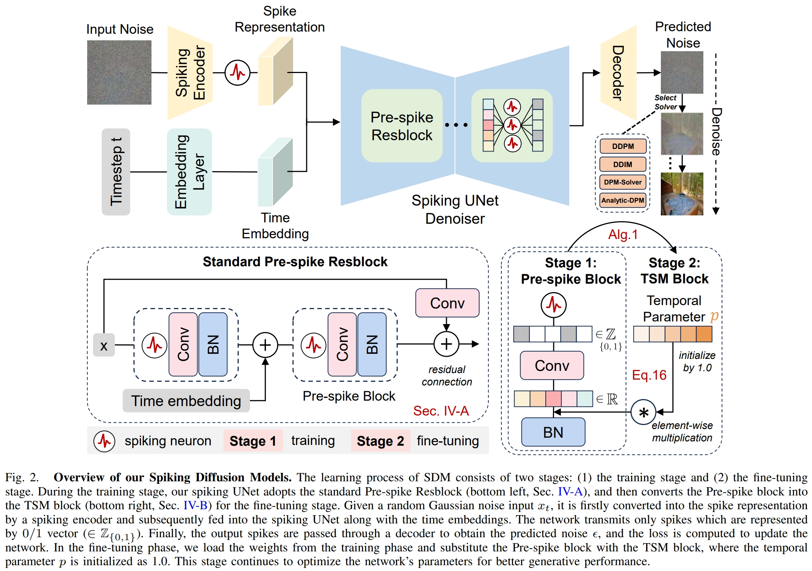
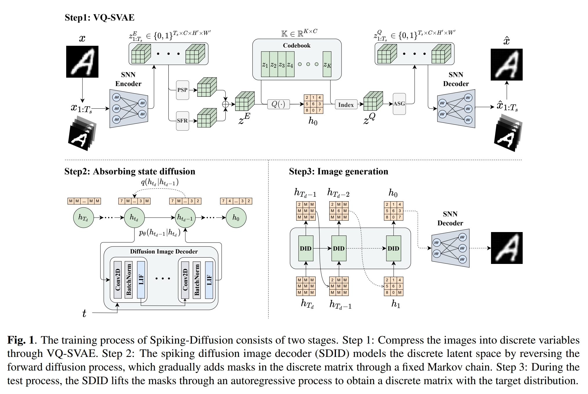
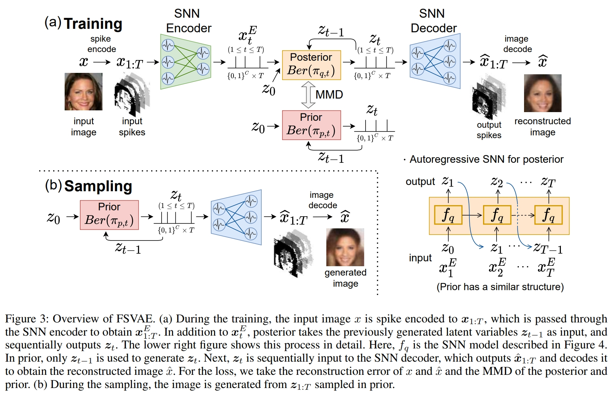
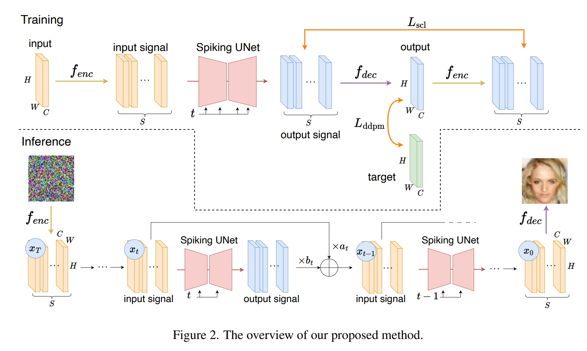
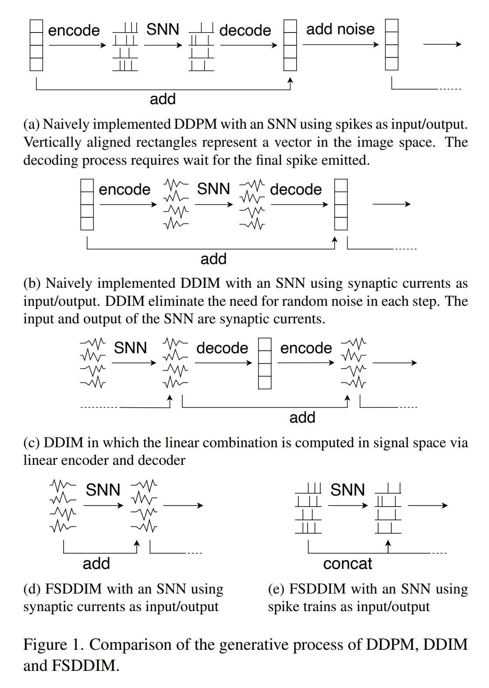
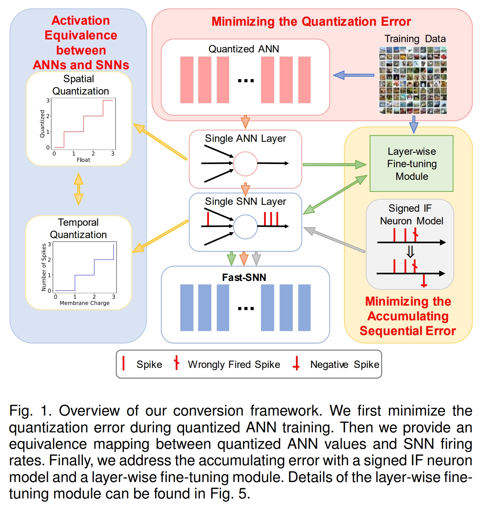

# Blog Brain-Inspired Computation Related

---
## Contents
 - [SNNs](#snns)
 - [LNNs](#lnns)

---

## SNNs

### Awesome Spiking Neural Networks [[github]](https://github.com/zhouchenlin2096/Awesome-Spiking-Neural-Networks)

### [Nature Communications 2024] Spike-based dynamic computing with asynchronous sensing-computing neuromorphic chip [[PDF]](https://www.nature.com/articles/s41467-024-47811-6)
_Man Yao, Ole Richter, Guangshe Zhao, Ning Qiao, Yannan Xing, Dingheng Wang, Tianxiang Hu, Wei Fang, Tugba Demirci, Michele De Marchi, Lei Deng, Tianyi Yan, Carsten Nielsen, Sadique Sheik, Chenxi Wu, Yonghong Tian, Bo Xu & Guoqi Li_

### [Nature Communications 2024] High-performance deep spiking neural networks with 0.3 spikes per neuron [[PDF]](https://www.nature.com/articles/s41467-024-51110-5)
_Ana Stanojevic, Stanisław Woźniak, Guillaume Bellec, Giovanni Cherubini, Angeliki Pantazi & Wulfram Gerstner_

### [Nature Scientific Reports 2024] Fast learning without synaptic plasticity in spiking neural networks [[PDF]](https://www.nature.com/articles/s41598-024-55769-0?fromPaywallRec=false)
_Anand Subramoney, Guillaume Bellec, Franz Scherr, Robert Legenstein & Wolfgang Maass_

### [Neural Networks 2023] An Exact Mapping From ReLU Networks to Spiking Neural Networks [[PDF]](https://arxiv.org/abs/2212.12522)
_Ana Stanojevic, Stanisław Woźniak, Guillaume Bellec, Giovanni Cherubini, Angeliki Pantazi, Wulfram Gerstner_

### [NeurIPS 2024] SpikeLLM: Scaling up Spiking Neural Network to Large Language Models via Saliency-based Spiking [[PDF]](https://arxiv.org/pdf/2407.04752v1)
_Xingrun Xing, Boyan Gao, Zheng Zhang, David A. Clifton, Shitao Xiao, Li Du, Guoqi Li, Jiajun Zhang_

### [ICML 2024] SpikeLM: Towards General Spike-Driven Language Modeling via Elastic Bi-Spiking Mechanisms [[PDF]](https://arxiv.org/abs/2406.03287)
_Xingrun Xing, Zheng Zhang, Ziyi Ni, Shitao Xiao, Yiming Ju, Siqi Fan, Yequan Wang, Jiajun Zhang, Guoqi Li_

### [ECCV 2024] Integer-Valued Training and Spike-Driven Inference Spiking Neural Network for High-performance and Energy-efficient Object Detection [[PDF]](https://www.arxiv.org/abs/2407.20708)
_Xinhao Luo, Man Yao, Yuhong Chou, Bo Xu, Guoqi Li_

### [ICML 2024] High-Performance Temporal Reversible Spiking Neural Networks with O(L) Training Memory and O(1) Inference Cost [[PDF]](https://arxiv.org/pdf/2405.16466)
_JiaKui Hu, Man Yao, Xuerui Qiu, Yuhong Chou, Yuxuan Cai, Ning Qiao, Yonghong Tian, Bo XU, Guoqi Li_

### [Nature Communications 2024] Temporal dendritic heterogeneity incorporated with spiking neural networks for learning multi-timescale dynamics [[PDF]](https://www.nature.com/articles/s41467-023-44614-z)
_Hanle Zheng, Zhong Zheng, Rui Hu, Bo Xiao, Yujie Wu, Fangwen Yu, Xue Liu, Guoqi Li & Lei Deng_

### [Science 2024] Network model with internal complexity bridges artificial intelligence and neuroscience [[PDF]](https://www.nature.com/articles/s43588-024-00674-9)
_Linxuan He, Yunhui Xu, Weihua He, Yihan Lin, Yang Tian, Yujie Wu, Wenhui Wang, Ziyang Zhang, Junwei Han, Yonghong Tian, Bo Xu & Guoqi Li_

### [ICLR 2024] Spike-driven Transformer V2 [[PDF]](https://arxiv.org/abs/2404.03663)
_Man Yao, Jiakui Hu, Tianxiang Hu, Yifan Xu, Zhaokun Zhou, Yonghong Tian, Bo Xu, Guoqi Li_

### [NeurIPS 2023] Spike-driven Transformer [[PDF]](https://arxiv.org/abs/2307.01694)
_Man Yao, Jiakui Hu, Zhaokun Zhou, Li Yuan, Yonghong Tian, Bo Xu, Guoqi Li_

### [ICCV 2023] Deep Directly-Trained Spiking Neural Networks for Object Detection [[PDF]](https://arxiv.org/abs/2307.11411)
_Qiaoyi Su, Yuhong Chou, Yifan Hu, Jianing Li, Shijie Mei, Ziyang Zhang, Guoqi Li_

### [TMLR 2023] SpikeGPT: Generative Pre-trained Language Model with Spiking Neural Networks [[PDF]](https://arxiv.org/abs/2302.13939)
_Rui-Jie Zhu, Qihang Zhao, Guoqi Li, Jason K. Eshraghian_

### [IEEE Transactions on Artificial Intelligence 2024] Spiking Diffusion Models [[PDF]](https://www.arxiv.org/abs/2408.16467)
_Jiahang Cao, Hanzhong Guo, Ziqing Wang, Deming Zhou, Hao Cheng, Qiang Zhang, Renjing Xu_
-  

### [arXiv 2023] Spiking-Diffusion: Vector Quantized Discrete Diffusion Model with Spiking Neural Networks [[PDF]](https://arxiv.org/abs/2308.10187)
_Mingxuan Liu, Jie Gan, Rui Wen, Tao Li, Yongli Chen, Hong Chen_
-  

### [AAAI 2022] Fully Spiking Variational Autoencoder [[PDF]](https://arxiv.org/abs/2110.00375)
_Hiromichi Kamata, Yusuke Mukuta, Tatsuya Harada_
- 

### [arXiv 2023] Spiking Generative Adversarial Network with Attention Scoring Decoding [[PDF]](https://arxiv.org/abs/2305.10246)
_Linghao Feng, Dongcheng Zhao, Yi Zeng_

### [arXiv 2023] Fully Spiking Denoising Diffusion Implicit Models [[PDF]](https://arxiv.org/abs/2312.01742)
_Ryo Watanabe, Yusuke Mukuta, Tatsuya Harada_
- 
- 

### [IEEE TPAMI 2023] Fast-SNN: Fast Spiking Neural Network by Converting Quantized ANN [[PDF]](https://arxiv.org/abs/2305.19868)
_Yangfan Hu, Qian Zheng, Xudong Jiang, Gang Pan_
- 

### [ECCV 2022] Neural Architecture Search for Spiking Neural Networks [[PDF]](https://arxiv.org/abs/2201.10355)
_Youngeun Kim, Yuhang Li, Hyoungseob Park, Yeshwanth Venkatesha, Priyadarshini Panda_

### [IEEE TSIP 2022] Federated Learning with Spiking Neural Networks [[PDF]](https://arxiv.org/abs/2106.06579)
_Yeshwanth Venkatesha, Youngeun Kim, Leandros Tassiulas, Priyadarshini Panda_

### [IEEE TPAMI 2021] Progressive Tandem Learning for Pattern Recognition with Deep Spiking Neural Networks [[PDF]](https://arxiv.org/abs/2007.01204)
_Jibin Wu, Chenglin Xu, Daquan Zhou, Haizhou Li, Kay Chen Tan_

### [ICLR 2020] Additive Powers-of-Two Quantization: An Efficient Non-uniform Discretization for Neural Networks [[PDF]](https://arxiv.org/abs/1909.13144)
_Yuhang Li, Xin Dong, Wei Wang_

---

## LNNs

### [Nature 2022] Closed-form continuous-time neural networks [[PDF]](https://www.nature.com/articles/s42256-022-00556-7)
_Ramin Hasani, Mathias Lechner, Alexander Amini, Lucas Liebenwein, Aaron Ray, Max Tschaikowski, Gerald Teschl & Daniela Rus_

### [Nature 2020] Neural circuit policies enabling auditable autonomy [[PDF]](https://www.nature.com/articles/s42256-020-00237-3)
_Mathias Lechner, Ramin Hasani, Alexander Amini, Thomas A. Henzinger, Daniela Rus & Radu Grosu_

---